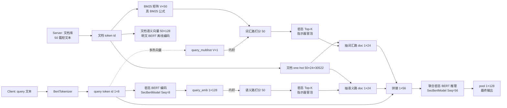

# 系统架构

## 概览

加密 RAG 由三层组成（自底向上）：

| 层 | 路径 | 职责 |
|---|---|---|
| **底层 MPC 库** | `NssMPClib/NssMPC/` | RingTensor、ASS、FSS、Beaver triples、密态层（SecBertModel 等）|
| **应用层** | `secure_rag/` | 双路检索 + 密态 Top-K + 联合推理；明文 baseline |
| **实验层** | `experiments/` | tokenizer、IR 指标、对比脚本 |

## 双路 RAG 数据流

## 密态 vs 明文 流程对照

| 步骤 | 密态版 | 明文版 |
|---|---|---|
| query 编码 | `client.py` 走 SecBertModel 密文路径 | `plaintext.py` 走 SecBertModel 明文路径 |
| 双路打分 | `retrieval.py` 三个 secure_* 函数（基于 ASS Beaver mul） | 同一份 PyTorch 张量直接乘加 |
| Top-K 排序 | 冒泡 + indicator swap，每次比较走 secure_ge → SIGMA DICF | `torch.topk` 一行 |
| 取真实文档 | `(indicator ⊗ db_tokens).sum(dim=1)` 全 ASS 操作 | 同一公式但用 PyTorch 张量 |
| 联合推理 | SecBertModel 全密态 forward | SecBertModel 明文 forward |
| 输出 | server 收 client 的 pool share，restore 还原 | 直接 return |

## 关键文件代码路径

- 双路打分函数：`secure_rag/retrieval.py:secure_inner_product_score / secure_lexical_score / secure_top_k_indicator`
- Server 流程：`secure_rag/server.py:run_server`
- Client 流程：`secure_rag/client.py:run_client`
- 明文等价物：`secure_rag/plaintext.py:plaintext_rag`
- 离线 doc 编码：`secure_rag/plaintext.py:encode_docs_to_embeddings`
- 真 BM25 公式：`secure_rag/plaintext.py:build_bm25_matrix`

## 通信开销（典型一条 query）

- send rounds: ~624
- send bytes: ~524 MB
- recv rounds: ~389
- recv bytes: ~319 MB

主要开销在 LayerNorm 的 rsqrt（SigmaDICF 64 轮 prefix-parity）和 SoftMax 的 exp。
