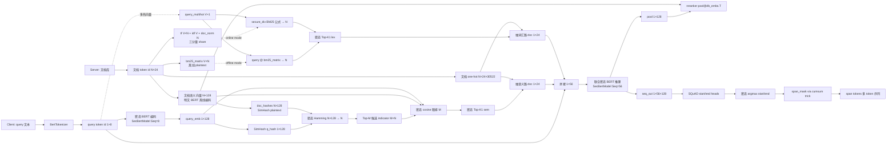

# 系统架构

## 概览

加密 RAG 由三层组成（自底向上）：

| 层 | 路径 | 职责 |
|---|---|---|
| **底层 MPC 库** | `NssMPClib/NssMPC/` | RingTensor、ASS、FSS、Beaver triples、密态层（SecBertModel 等）|
| **应用层** | `secure_rag/` | 双路检索 + 密态 Top-K + 联合推理 + Span Reader；明文 baseline |
| **实验层** | `experiments/` | tokenizer、IR 指标、对比脚本 |

## 与 Pisces (ICLR 2026) 的对齐策略

本架构借鉴 [Pisces](https://github.com/liang-xiaojian/Pisces) 的双路框架，但在协议层做了简化（保留 NssMPClib 兼容性），同时新增了三个正交组件：

| 维度 | Pisces ∏PrivateSS / ∏PrivateBM25 | 本工作 |
|---|---|---|
| **Sem 路粗筛** | SimHash → Oblivious filter (OPRF/OKVS) | SimHash → ASS Hamming + bubble top-M |
| **Sem 路精排** | 密态 cosine | 密态内积（cosine 等价） |
| **Lex 路 tf 获取** | Multi-instance labeled PSI | tf_matrix [V,N] share (无 PSI) |
| **Lex 路 BM25 公式** | 在线密态 (MPC-based) | **LEX_BM25_ONLINE=True 时同型** ⭐ |
| **Top-K** | Secure sorting | Bubble + indicator swap |
| **Cross-encoder Reranker** | ❌ 无 | ✅ pool @ db_embs.T (post-encoding) |
| **PRF / 多轮检索** | ❌ 无 | ✅ 跨路 PRF (sem→lex 反馈) |
| **生成阶段** | 委托外部密态 LLM (声明) | 委托接口 + **可跑 default span reader** |

## 双路 RAG 数据流（含 SimHash + Span Reader 升级版）

## 密态 vs 明文 流程对照

| 步骤 | 密态版 | 明文版 |
|---|---|---|
| query 编码 | `client.py` 走 SecBertModel 密文路径 | `plaintext.py` 走 SecBertModel 明文路径 |
| 双路打分 | `retrieval.py` 中 secure_* 函数（基于 ASS Beaver mul） | 同一份 PyTorch 张量直接乘加 |
| **Sem 路粗筛** | `secure_simhash_coarse_to_fine` (Hamming + cosine) | `plaintext_simhash_bits` + topk |
| **Lex 路 BM25** | `secure_lexical_score` (offline) / `secure_bm25_online_score` (online) | `build_bm25_matrix` / `build_bm25_components` |
| Top-K 排序 | 冒泡 + indicator swap，每次比较走 secure_ge → SIGMA DICF | `torch.topk` 一行 |
| 取真实文档 | `(indicator ⊗ db_tokens).sum(dim=1)` 全 ASS 操作 | 同一公式但用 PyTorch 张量 |
| 联合推理 | SecBertModel 全密态 forward | SecBertModel 明文 forward |
| **Reader** | `secure_reader_span`：cumsum-trick 算 span_mask + [1,L,V] send 保留顺序 | 直接 argmax over start/end logits |
| 输出 | server 把 rerank/pool/answer/span share 都 send 给 client，client restore | 直接 return |

## 关键文件代码路径

### 双路检索
- `secure_rag/retrieval.py:secure_inner_product_score / secure_lexical_score / secure_top_k_indicator`
- ⭐ `secure_rag/retrieval.py:secure_simhash_coarse_to_fine` — Pisces ∏PrivateSS 同型 sem 路
- ⭐ `secure_rag/retrieval.py:secure_bm25_online_score` — Pisces ∏PrivateBM25 同型 lex 路
- ⭐ `secure_rag/retrieval.py:secure_reader_span` — SQuAD start/end head 密态 span 抽取
- `secure_rag/retrieval.py:secure_rerank` — post-encoding rescoring
- `secure_rag/retrieval.py:secure_prf_expand_query` — 跨路 PRF 反馈

### 流程主线
- Server: `secure_rag/server.py:run_server`
- Client: `secure_rag/client.py:run_client`
- 明文等价: `secure_rag/plaintext.py:plaintext_rag`
- 子进程隔离启动: `experiments/_rag_runner.py + _cipher_worker.py`

### 配置开关
- `secure_rag/config.py:SIMHASH_ENABLED` (默认 True)
- `secure_rag/config.py:SIMHASH_BITS` (默认 128)
- `secure_rag/config.py:LEX_BM25_ONLINE` (默认 False，可开 True 切到 Pisces 同型协议)
- `secure_rag/config.py:SPAN_READER_ENABLED` (默认 True)
- `secure_rag/config.py:PRF_ENABLED + PRF_FEEDBACK_SOURCE` (跨路 PRF 配置)

## 通信开销（典型一条 query，含所有升级）

- 端到端耗时: ~78-82 秒
- send rounds: ~624 (基线) + ~64 (SimHash sign 比较) + ~10 (BM25 div, 如启用)
- send bytes: ~524 MB + ~14 MB ([1,L,V] span_token_oh send)
- recv rounds: ~389 + 同上
- recv bytes: ~319 MB + 同上

主要开销仍在联合密态 BERT (LayerNorm rsqrt SigmaDICF 64 轮 prefix-parity + SoftMax exp 查表)。
SimHash 加的 `> 0` 比较 ~1-2 秒；BM25 online 加的 secure_div 几乎免费 (batched)；Span Reader 加的 cumsum 累加几乎免费 (本地加法)。

