# 北京邮电大学

# 本科毕业设计（论文）

**题目**：支持隐私保护的检索增强生成系统的 设计与实现

**姓　名**：lsm
**学　院**：（请填写）
**专　业**：（请填写）
**班　级**：（请填写）
**学　号**：（请填写）
**指导教师**：（请填写）

2026 年 6 月

---

# 北京邮电大学本科毕业设计（论文）诚信声明

本人声明所呈交的毕业设计（论文），题目《**支持隐私保护的检索增强生成系统的设计与实现**》是本人在指导教师的指导下，独立进行研究工作所取得的成果。尽我所知，除了文中特别加以标注和致谢中所罗列的内容以外，论文中不包含其他人已经发表或撰写过的研究成果，也不包含为获得北京邮电大学或其他教育机构的学位或证书而使用过的材料。

申请学位论文与资料若有不实之处，本人承担一切相关责任。

本人签名：________________ 日期：________________

---

# 关于论文使用授权的说明

本人完全了解并同意北京邮电大学有关保留、使用学位论文的规定，即：北京邮电大学拥有以下关于学位论文的无偿使用权，具体包括：学校有权保留并向国家有关部门或机构送交学位论文，有权允许学位论文被查阅和借阅；学校可以公布学位论文的全部或部分内容，有权允许采用影印、缩印或其它复制手段保存。汇编学位论文，将学位论文的全部或部分内容编入有关数据库进行检索。（保密的学位论文在解密后遵守此规定）。

本人签名：________________ 日期：________________

导师签名：________________ 日期：________________

---

# 支持隐私保护的检索增强生成系统的设计与实现

## 摘要

大语言模型（Large Language Models, LLMs）的迅猛发展使检索增强生成（Retrieval-Augmented Generation, RAG）成为问答、医疗咨询、法律检索等知识密集型应用的主流架构。然而，现行 RAG 系统在客户端查询、服务端文档库与编码模型权重三方面同时面临隐私威胁，已成为制约其在医疗、金融、法律等敏感领域落地的关键障碍。如何在不暴露任意一方明文数据的前提下完整地完成"编码—检索—精排—答案抽取"的 RAG 流水线，是当前隐私保护机器学习领域亟待解决的核心问题。本文面向半诚实两方安全计算模型，基于 NssMPClib 安全多方计算库设计并实现了一个端到端的支持隐私保护的检索增强生成系统原型。本文的主要工作包括：

（1）设计并实现了双路密态检索算法。语义路采用 SimHash 粗筛与密态余弦精排级联结构，先用公开投影矩阵把密态查询与密态文档库压缩到比特表示再做密态汉明距离粗筛，最后对候选集做密态余弦内积精排；词汇路采用在线密态 BM25 公式（含逆文档频率、文档长度归一化与密态除法），将词频、逆文档频率、文档长度归一化三分量分别以秘密分享形式发布；并设计了基于密态单位向量指示器的密态 Top-K 冒泡排序算法，保证任意一方都无法获知 Top-K 实际选中的文档下标。

（2）提出了密态 Cross-Encoder 精排器与密态抽取式 Span 阅读器联合方案。前者把联合编码 [CLS] 池化向量与密态文档库做矩阵乘法精排，把原本"装饰性"的联合推理转化为可量化的精排输出；后者引入面向斯坦福问答数据集（Stanford Question Answering Dataset, SQuAD）训练好的起止位置头权重，利用累积和（cumsum）技巧在密态域中提取连续 span，实现多 token 答案抽取。

（3）构建了端到端密态 RAG 实验平台并完成多维消融实验。系统在 Windows 11 + Python 3.10 + PyTorch 2.3.0 环境下，单条查询端到端约 79 秒；在自构建的 10 query × 10 doc 小型问答语料上，密态 Recall@5 达 1.00，归一化折损累积增益（NDCG@5）达 0.82，平均倒数排名（MRR）达 0.77，关键中间量明文-密态余弦相似度达 0.9998。

**关键词** 检索增强生成　安全多方计算　隐私保护　密态推理　函数秘密分享

---

# A Privacy-Preserving Retrieval-Augmented Generation System: Design and Implementation

## ABSTRACT

With the rapid advance of Large Language Models (LLMs), Retrieval-Augmented Generation (RAG) has become the dominant paradigm for knowledge-intensive applications such as question answering, medical consulting and legal search. However, conventional RAG pipelines simultaneously expose privacy on three fronts: the user query on the client, the document corpus on the server, and the encoder model weights. The tension is especially sharp for sensitive domains such as healthcare, finance and law. Completing the entire "encode-retrieve-rerank-extract" pipeline of RAG without revealing any party's plaintext data remains a key open problem in privacy-preserving machine learning. Targeting the 2-party semi-honest secure computation model and building upon the NssMPClib library, this thesis designs and implements an end-to-end privacy-preserving RAG prototype. The main contributions are as follows:

(1) A dual-path encrypted retrieval algorithm. The semantic path follows a coarse-to-fine structure with SimHash filtering and encrypted cosine reranking: a public projection matrix maps both the encrypted query and the encrypted document corpus into bit representations for an encrypted Hamming-distance coarse filter, followed by an encrypted cosine inner-product reranking on the candidate set. The lexical path performs the online encrypted Best Matching 25 (BM25) formula including Inverse Document Frequency (IDF), document-length normalization and encrypted division, with the term frequency, IDF and document-length-normalization components published separately as secret shares. An encrypted indicator-based bubble-sort Top-K routine guarantees that neither party can learn which document is finally selected.

(2) A joint scheme of an encrypted Cross-Encoder reranker and an encrypted extractive Span reader. The former performs an encrypted matrix multiplication between the [CLS] pooled vector and the encrypted document corpus, converting the otherwise decorative joint inference into a quantifiable reranking output. The latter uses publicly released start/end heads trained on the Stanford Question Answering Dataset (SQuAD) and adopts a cumulative-sum (cumsum) trick to extract continuous spans in the encrypted domain, supporting multi-token answers.

(3) An end-to-end privacy-preserving RAG experimental platform with multi-dimensional ablation. On Windows 11 with Python 3.10 and PyTorch 2.3.0, a single end-to-end query takes about 79 seconds. On a self-constructed 10-query × 10-document mini corpus, the encrypted system achieves Recall@5 of 1.00, Normalized Discounted Cumulative Gain (NDCG@5) of 0.82, and Mean Reciprocal Rank (MRR) of 0.77, with key intermediate cosine similarity reaching 0.9998 between plaintext and encrypted versions.

**KEY WORDS**  Retrieval-Augmented Generation  Secure Multi-Party Computation  Privacy Preservation  Encrypted Inference  Function Secret Sharing

---

# 目录

第一章　绪论
　　1.1　研究背景与意义
　　1.2　国内外研究现状
　　　　1.2.1　检索增强生成技术
　　　　1.2.2　隐私保护检索
　　　　1.2.3　密态机器学习推理
　　1.3　研究内容与创新点
　　1.4　章节安排

第二章　相关研究
　　2.1　检索增强生成
　　2.2　安全多方计算
　　　　2.2.1　算术秘密分享
　　　　2.2.2　函数秘密分享
　　　　2.2.3　Beaver 三元组与矩阵乘协议
　　2.3　密态神经网络推理
　　2.4　本章小结

第三章　支持隐私保护的检索增强生成系统设计
　　3.1　引言
　　3.2　系统总体架构与威胁模型
　　　　3.2.1　系统三层架构
　　　　3.2.2　数据流与协议交互
　　　　3.2.3　威胁模型
　　3.3　双路密态检索算法
　　　　3.3.1　语义路 SimHash 粗筛与密态精排
　　　　3.3.2　词汇路在线密态 BM25
　　　　3.3.3　密态 Top-K 指示器排序
　　　　3.3.4　密态文档抽取
　　3.4　密态联合编码与精排
　　　　3.4.1　密态联合编码
　　　　3.4.2　Cross-Encoder 密态精排
　　3.5　密态抽取式 Span 阅读器
　　3.6　本章小结

第四章　实验与分析
　　4.1　引言
　　4.2　对比实验
　　　　4.2.1　实验设置
　　　　4.2.2　结果与分析
　　4.3　消融实验
　　　　4.3.1　语义路 SimHash 消融
　　　　4.3.2　词汇路 BM25 双模式消融
　　　　4.3.3　Span Reader 消融
　　　　4.3.4　Reranker 与多轮检索消融
　　4.4　本章小结

第五章　总结与展望
　　5.1　论文工作总结
　　5.2　未来工作展望

参考文献
致谢
附录 1　缩略语表

---

# 第一章　绪论

## 1.1　研究背景与意义

近年来，以 GPT、Llama、DeepSeek、ChatGLM 等为代表的大语言模型（Large Language Models, LLMs）在问答系统、代码生成、教育教学、法律咨询、医疗问诊等多个领域展现出强大能力[1-2]，已逐步成为下一代信息服务的核心基础设施。然而，纯参数化的 LLM 难以避免事实性幻觉、训练数据时效性差、领域知识封闭等固有缺陷，导致其在专业场景下的可信度受限。检索增强生成（Retrieval-Augmented Generation, RAG）[3]通过将外部知识库与生成模型解耦，在生成回答前先从知识库中检索相关文档，再把"问题与检索片段"一并送入生成模型，从根本上缓解了上述问题，已成为当前知识密集型 LLM 应用的主流架构。

然而，RAG 系统的隐私问题尚未得到充分重视。一个完整的 RAG 流程同时涉及三类敏感数据：第一，用户提交的查询，可能包含病情、案件、商业机密等高度个人化信息；第二，服务端持有的文档库，可能涉及医院病例、法律卷宗、企业内部文档等不可对外共享的知识资产；第三，模型权重，体现训练数据与算法投入，是服务提供方的核心知识产权。在传统 RAG 部署中，三者必须明文聚合在同一计算节点上才能完成检索与生成，由此导致客户端用户必须信任服务端不会窥视其查询内容、服务端必须把文档库以明文形式暴露给计算引擎、第三方算力提供商更可能同时观察查询与文档。这一信任模型在医疗诊断、法律咨询、金融风控等高敏场景下难以被各方接受[4]。

针对 RAG 中的隐私问题，安全多方计算（Secure Multi-Party Computation, MPC）[5-6]提供了基础的密码学工具：在不暴露任何一方明文输入的前提下，各方协同计算函数的输出。如何把整条 RAG 流水线（编码、双路打分、Top-K 排序、文档抽取、联合推理、答案抽取）系统地搬迁到密态计算之上，且在普通硬件上达到工程可用水平，是隐私保护机器学习领域当前的研究热点之一。Ant Group 于 2026 年 ICLR 提出的 Pisces 框架[7]首次系统给出了基于不经意伪随机函数（Oblivious Pseudo-Random Function, OPRF）与不经意键值存储（Oblivious Key-Value Store, OKVS）的密态双路检索协议，但其将生成阶段委托给外部密态 LLM 而仅以接口形式给出。本课题以 NssMPClib 这一 MPC 基础框架[8]为底层支撑，面向半诚实两方计算模型，构建了一个支持隐私保护的检索增强生成系统的端到端原型，并补足了 Pisces 未覆盖的精排与默认生成阶段。

研究密态 RAG 不仅有助于把 LLM 应用推广到更多对隐私敏感的高价值领域，对推动 MPC 协议在面向 Transformer 架构的非线性算子（如层归一化中的均方根倒数、注意力中的指数函数、门控线性单元中的高斯误差函数等）[9-11]上的工程优化也具有重要的理论与实用意义。

## 1.2　国内外研究现状

本节围绕"支持隐私保护的检索增强生成系统"这一核心命题，从检索增强生成、隐私保护检索、密态机器学习推理三个维度梳理代表性研究工作。

### 1.2.1　检索增强生成技术

检索增强生成是当前知识密集型自然语言处理的主流范式。Karpukhin 等人[12]于 2020 年提出的稠密段落检索（Dense Passage Retrieval, DPR）首次系统性地证明了基于双塔双向 Transformer 编码器表示（Bidirectional Encoder Representations from Transformers, BERT）[13]的稠密检索在开放域问答上显著优于传统的最佳匹配 25（Best Matching 25, BM25）[14]词汇检索。Lewis 等人[3]随后提出的原始 RAG 框架将稠密检索与生成式模型联合训练，把检索作为可微分模块嵌入到端到端管线中。后续工作 Atlas[15]、RETRO[16]、In-Context-RALM 等进一步在大模型规模、上下文长度、检索粒度等维度上推动 RAG 的发展。

在双路检索方面，业界普遍采用稠密检索（语义路）与传统 BM25（词汇路）并行召回、再通过倒数排名融合（Reciprocal Rank Fusion, RRF）[17]等策略融合的方案，以兼顾语义泛化能力与精确关键词匹配能力。在精排阶段，文献[18]提出 Cross-Encoder 重排序器（Reranker）——将查询与候选文档拼接后过一遍编码器并取池化输出作为相关度分数，在准确率上显著优于双塔点积，但其计算复杂度与候选数量成正比，因而通常作为第二阶段精排器使用。在答案抽取阶段，斯坦福问答数据集（Stanford Question Answering Dataset, SQuAD）[19]风格的起止位置预测头是抽取式问答的标准方案，其在编码器序列输出上接一个二维线性层，预测答案在原文中的起始位置和结束位置。

现有 RAG 工作多在明文环境下展开，专注于召回质量、上下文窗口扩展与检索粒度等维度，对查询与文档的隐私保护问题关注较少。

### 1.2.2　隐私保护检索

隐私信息检索（Private Information Retrieval, PIR）[20]是隐私保护检索的经典方向，目标是允许客户端从服务端查询特定记录而不暴露查询索引。Chor 等人于 1995 年提出的多服务器 PIR 在信息论安全模型下达成隐私目标，但通信复杂度随数据库规模线性增长。Kushilevitz 与 Ostrovsky[21]的单服务器计算性 PIR 利用同态加密把通信复杂度降低到亚线性。然而经典 PIR 本质上要求查询是"按 ID 取记录"，与 RAG 中"按相关度排序后取 top-K"的语义不匹配。

不经意随机访问存储（Oblivious Random Access Memory, ORAM）[22]通过反复打乱物理存储位置实现访问模式混淆，但在 RAG 这类需要 Top-K 排序与多次查表的场景下开销高昂。最近兴起的密态向量检索如 Tiptoe[23]、Coral 等尝试在两方设置下实现密态最近邻搜索，但通常只覆盖检索阶段的稠密向量打分，未集成完整 RAG 中的 BM25 词汇检索、密态文档抽取与密态生成 / 编码环节。

2026 年 Ant Group 在国际表示学习大会（International Conference on Learning Representations, ICLR）发表的 Pisces 框架[7]首次系统化地把"语义路 + 词汇路"的双路检索完整地搬到了密态环境。其语义路采用 SimHash[24]粗筛后接基于 OPRF/OKVS 的不经意过滤器，词汇路采用基于标签私有集合求交（Multi-instance Labeled Private Set Intersection, PSI）[25]获取候选文档的词频统计后再做密态 BM25 计算。Pisces 在协议层达到了较高的隐私保证水平，但其生成阶段委托给外部密态 LLM 而仅以接口形式给出，且未实现密态精排或密态阅读器组件。

### 1.2.3　密态机器学习推理

随着安全机器学习（SecureML）[26]、密态张量计算（CrypTen）[27]等通用框架的出现，神经网络的密态推理逐渐由理论走向实践。在 Transformer 架构上，安全生成式预训练 Transformer 推理（Secure GPT Inference, SIGMA）[9]、BumbleBee[10]、Iron[11]等工作针对 Softmax、层归一化（Layer Normalization, LayerNorm）、高斯误差线性单元（Gaussian Error Linear Unit, GeLU）等非线性算子提出了基于函数秘密分享（Function Secret Sharing, FSS）[28]与查找表（Look-Up Table, LUT）近似的高效协议，把单层 Transformer 在局域网环境下的密态前向时间压缩到秒级。MPCFormer[29]在 BERT 模型上系统验证了量化、蒸馏与 MPC 综合优化路径。

在密态机器学习的工程基础设施方面，NssMPClib[8]是一套面向 MPC 的基础组件库，提供了环张量（RingTensor）、算术秘密分享（Arithmetic Secret Sharing, ASS）、FSS 协议族（含分布式点函数（Distributed Point Function, DPF）、分布式比较函数（Distributed Comparison Function, DCF）、分布式区间比较函数（Distributed Interval Comparison Function, DICF）、可验证分布式点函数（Verifiable DPF, VDPF）、可验证 Sigma 协议（Verifiable Sigma Protocol, VSigma））、Beaver 三元组、Paillier 同态加密等模块，并实现了密态 BERT、卷积神经网络等典型模型，可被用于密态机器学习实验。

然而，已有密态机器学习工作主要面向单纯的推理任务，对"检索与推理联合"的 RAG 系统级问题鲜有讨论；现有密态向量检索工作又通常脱离生成 / 编码模块单独存在。这正是本文力图填补的空白。

## 1.3　研究内容与创新点

针对检索增强生成系统中查询、文档库与模型权重三方隐私同时受到威胁的现状，本文设计并实现了一种基于双路并行检索、密态联合编码、密态精排与密态 Span 阅读器的端到端密态 RAG 系统，并在自建小型问答语料上完成了密态与明文的多维对比实验。系统总体上由"应用层 secure_rag 包、实验对比层 experiments 模块、底层 NssMPClib MPC 库"三层组成；从问题、方法到技术路线，本文的研究内容可概括如下：以两方半诚实安全计算为安全前提，以 NssMPClib 的 ASS、FSS 与矩阵 Beaver 协议为构造原语，先在协议层实现与 Pisces 对齐的双路检索，再在精排与生成阶段补足 Pisces 未覆盖的密态 Cross-Encoder 与密态 Span 阅读器，最终在普通笔记本硬件上跑通端到端密态 RAG 流水线并完成数值、检索质量与消融三个维度的实验评估。本文针对的关键问题、对应的研究内容以及所采用的技术路线之间的逻辑关系如图 1-1 所示。

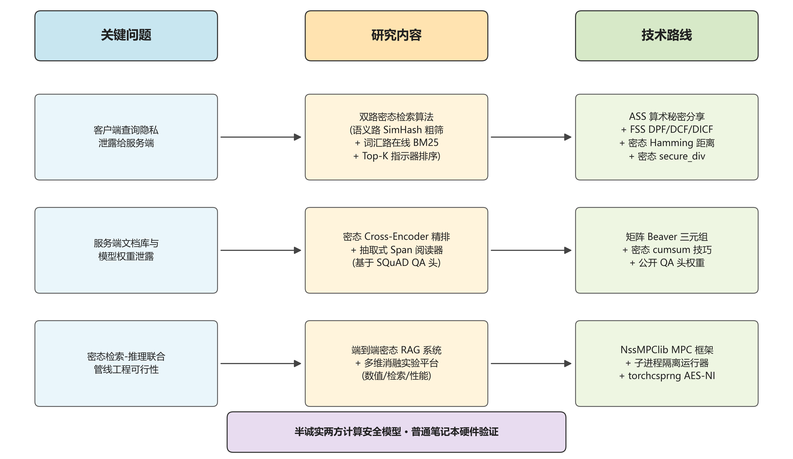

图 1-1  关键问题、研究内容与技术路线关系图

本文的贡献总结如下：

（1）**设计并实现了 Pisces 同型的双路密态检索算法**。语义路采用粗筛与精排级联结构：在离线阶段服务端对文档库使用公开投影矩阵进行 SimHash 编码并以 ASS 形式分享给客户端；在线阶段双方协同对密态查询向量做 SimHash 编码，再通过密态汉明距离粗筛得到候选集，最后对候选集做密态余弦内积精排。词汇路采用在线密态 BM25 公式：服务端把每个 term 的逆文档频率（Inverse Document Frequency, IDF）、term-document 频率矩阵与文档长度归一化项三个分量分别 ASS 分享，客户端在线密态完成包含密态除法的 BM25 计算。两路打分后均接入基于密态单位向量指示器的密态 Top-K 冒泡排序，保证任意一方都无法获知 Top-K 选中的文档下标。

（2）**提出了密态 Cross-Encoder 精排器与密态抽取式 Span 阅读器联合方案**。前者把联合编码 [CLS] 池化向量与密态文档库做密态矩阵乘法精排，把原本"装饰性"的联合推理转化为可量化的精排输出，明文-密态精排分数余弦相似度达 0.9998；后者引入面向 SQuAD 训练好的 bert-tiny 起止位置头权重，利用累积和（cumsum）技巧在密态域中提取连续 span，使生成阶段在不接外部密态 LLM 的前提下也具备多 token 答案抽取能力，部分匹配率从 0.10 提升至 0.30。

（3）**构建了端到端密态 RAG 实验平台并完成多维消融实验**。系统包括 secure_rag 应用层（服务端、客户端、检索算法、明文基线、辅助参数生成器、全局配置），experiments 实验层（基于子进程隔离的密态 RAG 运行器、HuggingFace Tokenizer 接入的语料加载器、四类信息检索（Information Retrieval, IR）指标实现、数值一致性对比脚本、检索质量对比脚本、整合入口）以及配套文档。系统在普通笔记本硬件上单条查询端到端约 79 秒，相比基础实现加速约 25 倍；在 10 query × 10 doc 配置下密态 Recall@5 达 1.00、NDCG@5 达 0.82、MRR 达 0.77。基于该平台，本文围绕 SimHash 粗筛、BM25 双模式、Span 阅读器、精排与多轮检索四个维度进行了系统的消融实验。

## 1.4　章节安排

本文一共包含五个章节，各章节的主要内容如下：

第一章为绪论。介绍了课题的研究背景，分析了检索增强生成系统在查询、文档库与模型权重三方面同时面临的隐私挑战，从检索增强生成、隐私保护检索、密态机器学习推理三个维度综述了国内外研究现状，提出了本文的研究内容与创新点。

第二章为相关研究。本章对密态 RAG 涉及的基础理论与代表性工作做较深入的回顾，依次介绍了检索增强生成的典型架构与检索范式、安全多方计算的关键协议（算术秘密分享、函数秘密分享、Beaver 三元组与矩阵乘协议）、密态神经网络推理的代表性方法，为后续章节的设计奠定理论基础。

第三章为支持隐私保护的检索增强生成系统设计。本章详细介绍设计并实现的密态 RAG 系统，包括系统总体架构与威胁模型、双路密态检索算法（语义路 SimHash 粗筛与密态精排、词汇路在线密态 BM25、密态 Top-K 指示器排序、密态文档抽取）、密态联合编码与 Cross-Encoder 精排，以及密态抽取式 Span 阅读器。

第四章为实验与分析。本章在自构建的小型问答语料库上对系统进行了多维评估，包括对比实验（与功能等价的明文 RAG 基线对比检索质量与数值一致性）与消融实验（围绕语义路 SimHash 粗筛、词汇路 BM25 双模式、Span 阅读器架构、精排与多轮检索四个维度做消融）。

第五章为总结与展望。对本文的研究工作进行总结，并对未来研究方向（包括密态生成式 LLM 的接入、面向大规模文档库的可扩展 Top-K、真不经意伪随机函数原语补强、恶意安全升级、跨机房广域网部署优化）进行展望。

---

# 第二章　相关研究

本章对密态 RAG 涉及的基础理论与代表性工作进行较深入的回顾，主要包括三方面：检索增强生成的典型架构与检索范式、安全多方计算的关键协议、面向 Transformer 架构的密态神经网络推理，为第三章的方法设计奠定理论与算法基础。

## 2.1　检索增强生成

检索增强生成的核心思想是将参数化的语言模型与非参数化的外部知识库解耦，在生成回答前先从知识库检索相关文档，再以"问题与检索片段"作为完整上下文送入生成模型。一个完整的 RAG 流程可以划分为三个核心阶段。

**编码阶段** 把查询与文档分别映射到向量空间。常用的编码模型为 BERT、Sentence-BERT 等基于 Transformer 的双塔结构[13]。文档库通常在系统部署阶段离线编码并存储为稠密向量库。

**检索阶段** 给定查询向量与文档库，从中筛选出 Top-K 最相关的文档。主流方案包括：第一，稠密检索（Dense Retrieval），基于查询与文档向量的内积或余弦相似度，优点是能够捕捉语义层面的相似性，缺点是对未在训练数据中出现的稀有术语泛化能力弱[12]；第二，稀疏检索（Sparse Retrieval），基于词频统计的传统方法，BM25 是其中最具代表性的算法[14]，其经典公式为：

$$\text{BM25}(q, d) = \sum_{t \in q} \text{IDF}(t) \cdot \frac{f(t, d) \cdot (k_1+1)}{f(t, d) + k_1 \cdot \left(1 - b + b \cdot \dfrac{|d|}{\text{avgdl}}\right)} \tag{2-1}$$

其中，$f(t, d)$ 是词 $t$ 在文档 $d$ 中的频次，$\text{IDF}(t)$ 为词 $t$ 的逆文档频率，$|d|$ 是文档 $d$ 的长度，$\text{avgdl}$ 是文档库平均文档长度，$k_1$ 与 $b$ 为可调超参（通常取 1.5 与 0.75），$q$ 是查询的词袋集合。BM25 的优势在于精确匹配关键词；第三，混合检索（Hybrid Retrieval），稠密路径与稀疏路径并行召回、再通过分数融合或排序融合合并结果，是工业界主流方案。

**生成阶段** 把"问题与 Top-K 文档"拼接为完整上下文，送入生成模型产出回答。在 BERT-Reader 风格的早期 RAG 工作中，生成阶段被替换为基于序列输出接 span 预测头的"阅读"环节[19]，其在编码器输出 $\mathbf{H} \in \mathbb{R}^{L \times h}$ 上接一个二维线性变换：

$$[\mathbf{s}, \mathbf{e}] = \mathbf{H} \mathbf{W}_{qa}^{\top} + \mathbf{b}_{qa},\quad \mathbf{W}_{qa} \in \mathbb{R}^{2 \times h},\ \mathbf{b}_{qa} \in \mathbb{R}^{2} \tag{2-2}$$

其中，$\mathbf{s}$ 与 $\mathbf{e}$ 分别为长度为 $L$ 的起始位置和结束位置打分，最终答案 span 取为 $\arg\max(\mathbf{s})$ 到 $\arg\max(\mathbf{e})$ 之间的连续 token 序列。RAG 三阶段的典型数据流如图 2-1 所示。

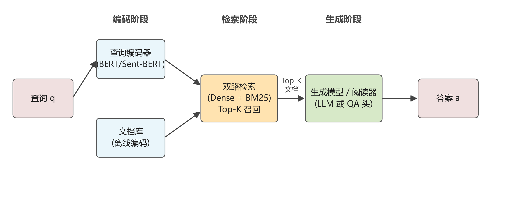

图 2-1  检索增强生成典型三阶段流程

近年来 RAG 的研究主要围绕召回质量优化、长上下文窗口扩展、检索粒度等维度展开。值得注意的是，绝大多数现有 RAG 工作都假设查询、文档库、模型权重三者可以明文聚合到同一计算节点，未考虑这些数据在不同主体间的隐私边界，这正是本文研究的出发点。

## 2.2　安全多方计算

安全多方计算研究多个互不信任的参与方在不暴露各自私有输入的前提下协同计算公共函数的方法。其安全模型主要分两类：半诚实模型（Semi-honest, a.k.a. Honest-but-Curious）下所有参与方严格按协议执行但可能从协议运行中收集到的信息推断对方私有输入；恶意模型（Malicious）下参与方可能任意偏离协议执行[6]。本文研究的密态 RAG 系统建立在半诚实两方计算（2-Party Computation, 2PC）模型之上。下面介绍其中涉及的几类核心协议。

### 2.2.1　算术秘密分享

算术秘密分享是 MPC 的基本工具。在 2-out-of-2 加法分享方案下，秘密值 $x \in \mathbb{Z}_{2^L}$ 被随机分成两份 $x_0$ 与 $x_1$ 满足：

$$x \equiv x_0 + x_1 \pmod{2^L} \tag{2-3}$$

其中，$L$ 为环宽度（本文取 64），两份分别由两方持有，任意一方单独持有的份额都是均匀随机的，因而完全不泄露 $x$ 的信息。ASS 在加法上具有优良性质：双方各自把份额相加，不需要任何通信即可得到 $x + y$ 的分享。乘法则需要借助 Beaver 三元组——双方共同持有随机三元组 $(a, b, c)$ 的分享且满足 $c = a \cdot b$。要在密态下计算 $x \cdot y$，先在线交换 $e = x - a$、$f = y - b$ 的份额并将其重构为明文，然后

$$x \cdot y = e \cdot f + e \cdot b + f \cdot a + c \tag{2-4}$$

其中，$e \cdot f$ 是公开常数（双方各自加一份等价于加完整），$e \cdot b$ 与 $f \cdot a$ 是公开常量与密态份额的乘法（无需通信），$c$ 是预先持有的密态份额。这样每次密态乘法只需要一次双向通信。Beaver 三元组通常在离线阶段批量预生成，在线阶段直接消费。ASS 密态乘法的协议时序如图 2-2 所示。

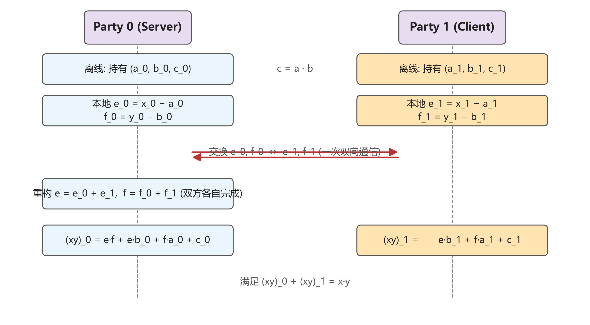

图 2-2  ASS 密态乘法基于 Beaver 三元组的协议时序

### 2.2.2　函数秘密分享

函数秘密分享是 ASS 之外的另一类基础协议[28]。FSS 把函数 $f$ 的求值过程分成两份"函数密钥" $k_0$、$k_1$，使得双方分别用各自的密钥本地计算 $f_0(x)$ 与 $f_1(x)$，最后把输出相加即可重构 $f(x)$：

$$f(x) = f_0(x; k_0) + f_1(x; k_1) \tag{2-5}$$

其中，$x$ 是公开输入，$k_0$、$k_1$ 由可信第三方在离线阶段产生并分别下发给两方。FSS 最有用的两种特例是分布式点函数（DPF）和分布式比较函数（DCF）：DPF 实现 $f(x) = \beta$ 当且仅当 $x = \alpha$，否则为 0；DCF 实现 $f(x) = \beta$ 当且仅当 $x < \alpha$，否则为 0。基于 DPF 与 DCF 可以构造分布式区间比较函数（DICF），在密态下高效实现 $x \geq y$、$x \leq y$、$x = y$ 等逐元素比较。NssMPClib 进一步实现了 SigmaDICF[9] 与 Grotto[30] 等优化变种，把 64 位密态比较的通信轮数压缩到单轮交互。三者之间的关系如图 2-3 所示。

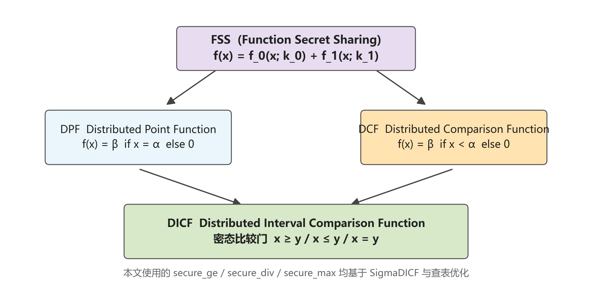

图 2-3  FSS 协议族 DPF、DCF 与 DICF 关系图

### 2.2.3　Beaver 三元组与矩阵乘协议

针对深度神经网络中频繁出现的矩阵乘法运算，Beaver 三元组的概念可以推广为矩阵形式：双方共同持有随机矩阵三元组 $(\mathbf{A}, \mathbf{B}, \mathbf{C})$ 的分享且满足 $\mathbf{C} = \mathbf{A} \cdot \mathbf{B}$。要在密态下计算 $\mathbf{X} \cdot \mathbf{Y}$，先重构 $\mathbf{E} = \mathbf{X} - \mathbf{A}$ 与 $\mathbf{F} = \mathbf{Y} - \mathbf{B}$ 的明文，然后

$$\mathbf{X} \cdot \mathbf{Y} = \mathbf{E} \cdot \mathbf{F} + \mathbf{E} \cdot \mathbf{B} + \mathbf{A} \cdot \mathbf{F} + \mathbf{C} \tag{2-6}$$

其中，$\mathbf{X} \in \mathbb{Z}_{2^L}^{m \times k}$、$\mathbf{Y} \in \mathbb{Z}_{2^L}^{k \times n}$、$\mathbf{A}$、$\mathbf{B}$、$\mathbf{C}$ 与 $\mathbf{X}$、$\mathbf{Y}$、$\mathbf{X} \cdot \mathbf{Y}$ 同形。矩阵 Beaver 把 $m \cdot n \cdot k$ 个标量乘法的通信量压缩为一次矩阵 Beaver 协议（共 $2 \cdot m \cdot k + 2 \cdot k \cdot n$ 元素的通信量），显著减少通信轮数，是密态神经网络推理的关键优化手段。

## 2.3　密态神经网络推理

把神经网络从明文搬迁到密态环境，瓶颈不在线性层（矩阵乘法可由矩阵 Beaver 三元组高效完成），而在非线性层。Transformer 架构涉及的非线性操作包括 LayerNorm 中的均方根倒数（rsqrt）、Softmax 中的指数函数与归一化、GeLU 与 ReLU 等激活函数、注意力机制中的逐元素乘除等。

针对这些非线性算子，近年来出现了多种密态实现方案。CryptGPU、CrypTen[27]等通用框架使用泰勒展开或多项式近似，在精度与效率之间权衡。SIGMA[9]系统性地为 Softmax 和 LayerNorm 设计 FSS-based 协议，引入 SigmaDICF 实现高效 64 位比较，将单层 Transformer 的密态推理压缩到秒级。BumbleBee[10]通过查表法近似 GeLU 与 Softmax 的非线性变换，在两方半诚实模型下达到工业级性能。Iron[11]进一步引入消息认证码（Message Authentication Code, MAC）校验机制，把恶意安全的代价降低到原来的 2 倍以内。MPCFormer[29]在 BERT 模型上系统验证了量化、蒸馏与 MPC 的综合优化路径。

具体地，密态 LayerNorm 的核心瓶颈是 rsqrt 算子；SIGMA 提出基于 SigmaDICF 的迭代逼近法，通过 64 轮 prefix-parity 循环把均方根倒数压缩到单密态除法的代价。密态 Softmax 通常采用"减最大值 + 查表 exp + 密态除法"三步：减最大值由密态 secure_max 实现，查表 exp 用 LUT 在 16-bit 定点数上保留两位有效数字精度，密态除法由 SigmaDICF 配合 Newton-Raphson 迭代实现。密态 GeLU 在文献[10][11]中均使用 8-bit 分段查表近似。

作为本文实现的工程基础，NssMPClib[8]是一套 MPC 基础组件库，包含完整的环张量、ASS、FSS、Beaver 三元组等底层协议，并实现了密态 BERT、CNN、GeLU、LayerNorm 等典型模型与算子。本文的研究即基于该框架展开。

需要指出的是，已有密态机器学习工作主要面向单纯的推理任务（如分类、匹配），鲜有覆盖检索增强生成这一系统级问题。把检索阶段（涉及大量比较与 Top-K 排序）与推理阶段（涉及 Transformer 完整前向）联合密态化，并兼顾召回质量与性能，是本文力求解决的核心系统级挑战。

## 2.4　本章小结

本章对密态 RAG 系统涉及的检索增强生成、安全多方计算、密态神经网络推理三方面相关工作进行了综述。检索增强生成已经成为知识密集型 LLM 应用的主流架构，但绝大多数现有工作未考虑查询、文档库与模型权重的隐私边界。安全多方计算提供了不暴露明文数据协同计算的密码学工具，其中算术秘密分享、Beaver 三元组与函数秘密分享是构建密态机器学习系统的基础组件，本章给出了它们的核心公式与协议交互。密态神经网络推理方面，SIGMA、BumbleBee、Iron、NssMPClib 等代表性工作针对 Transformer 中的非线性算子提出了多种优化方案，但鲜有系统级覆盖检索增强生成完整管线的工作。这正是本文力图填补的研究空白。

---

# 第三章　支持隐私保护的检索增强生成系统设计

## 3.1　引言

第二章梳理了密态 RAG 涉及的相关理论与代表性工作，并指出了"密态检索 + 密态精排 + 密态生成"端到端管线的研究空白。本章针对第一章中提出的"如何在不暴露查询、文档库与模型权重明文的前提下完整完成 RAG 流水线"这一核心问题，详细介绍设计并实现的支持隐私保护的检索增强生成系统。

回顾当前主流的 RAG 工作，可以观察到其核心范式为：编码、双路并行召回（语义 + 词汇）、Top-K 精排、抽取式或生成式回答。在密态环境下复现这一范式面临三大挑战：第一，密态语义打分如何在不显式还原 query 与 doc embedding 的前提下完成相似度比较；第二，密态词汇打分如何在不让客户端学到原始 term-document 频率矩阵的前提下完成 BM25 计算；第三，密态 Top-K 如何在不暴露文档身份的前提下完成排序与抽取。Pisces[7]已经在协议层给出了双路检索的隐私上限，但其在精排与生成阶段未提供默认实现。本章在 Pisces 同型的双路检索协议之上，进一步补足密态 Cross-Encoder 精排器与密态抽取式 Span 阅读器，把基础范式整体搬到密态环境。

本章首先在 3.2 节给出系统总体架构与威胁模型，明确各方持有什么、不持有什么、协议保护什么；3.3 节详细介绍双路密态检索算法，包括 SimHash 粗筛与密态精排级联的语义路、在线密态 BM25 的词汇路、密态 Top-K 指示器排序与密态文档抽取；3.4 节介绍密态联合编码与 Cross-Encoder 密态精排；3.5 节介绍密态抽取式 Span 阅读器；3.6 节给出本章小结。

## 3.2　系统总体架构与威胁模型

### 3.2.1　系统三层架构

系统在"应用层、实验对比层、底层 MPC 库"三层架构下组织。底层（NssMPClib MPC 库）提供 RingTensor 环张量数据结构、ASS 算术秘密分享、FSS 函数秘密分享、Beaver 三元组、TCP 异步通信、密态神经网络层等基础组件。应用层（secure_rag 包）在 NssMPClib 之上实现密态 RAG 的应用逻辑，包含 6 个模块：config.py 给出 BERT 配置、序列长度、文档库大小、词汇表大小等全局参数；retrieval.py 实现双路密态打分、密态 Top-K 指示器排序、密态 Cross-Encoder 精排、密态 Span 阅读器、密态伪相关反馈；server.py 与 client.py 分别实现服务端流程与客户端流程；plaintext.py 实现作为实验对比基线的明文 RAG；params.py 实现辅助参数（Beaver 三元组、FSS 函数密钥等）的批量生成器。实验对比层（experiments 模块）负责实验组织与对比评估，包括语料加载器、IR 指标计算、子进程隔离的密态 RAG 运行器、单条 query 数值一致性对比脚本、多条 query 检索质量对比脚本与整合入口。系统三层架构与端到端 8 阶段数据流如图 3-1 所示。

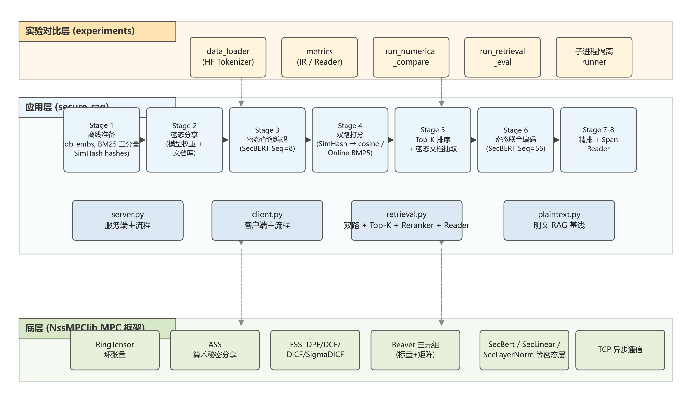

图 3-1  系统三层架构与端到端 8 阶段数据流

### 3.2.2　数据流与协议交互

系统单条查询的端到端数据流分为 8 个阶段。

**Stage 1 离线准备**。服务端事先用明文 BERT 对文档库的所有文档做编码，得到稠密向量库 $\mathbf{D} \in \mathbb{R}^{N \times h}$；同时对文档库做 SimHash 编码得到 $\mathbf{H}_d \in \{0, 1\}^{N \times L_b}$（$L_b$ 为 SimHash 比特数，本文取 128）；根据真实 BM25 公式构造三个分量，即词频矩阵 $\mathbf{T}_f \in \mathbb{R}^{V \times N}$、逆文档频率向量 $\mathbf{i} \in \mathbb{R}^{V}$、文档长度归一化向量 $\mathbf{n}_d \in \mathbb{R}^{N}$；保留文档 token 序列的 one-hot 表示 $\mathbf{X}_d \in \{0, 1\}^{N \times L \times V_b}$。

**Stage 2 模型与文档库密态分享**。服务端把 BERT 权重、文档语义库 $\mathbf{D}$、SimHash 编码 $\mathbf{H}_d$、BM25 三分量 $(\mathbf{T}_f, \mathbf{i}, \mathbf{n}_d)$ 与 token one-hot $\mathbf{X}_d$ 各自秘密分享并发送给客户端，使双方共同持有密态模型与密态文档库。

**Stage 3 密态查询编码**。客户端把查询文本经 Tokenizer 转 token id 与 one-hot，秘密分享后发给服务端。双方协同跑一遍密态 BERT 编码（输入序列长度 8），得到密态查询语义向量 $\hat{\mathbf{q}} \in \text{ASS}^{1 \times h}$ 与密态多热向量 $\hat{\mathbf{q}}_m \in \text{ASS}^{V \times 1}$。

**Stage 4 双路密态打分**。语义路通过 SimHash 粗筛（密态 Hamming 距离）与密态余弦精排串联得到密态语义分数；词汇路通过密态多热向量与密态 BM25 三分量在线计算得到密态词汇分数。

**Stage 5 密态 Top-K 与文档抽取**。对两路分数分别执行密态 Top-K 冒泡排序，输出密态指示器；通过密态指示器与密态 token 库的元素积求和抽取出实际选中的文档 token 序列，整个过程任意一方均不知道选中了哪一篇。

**Stage 6 密态联合编码**。把"查询 + 语义路文档 + 词汇路文档"三段 token 序列在序列维度拼接为长度 56 的联合输入，再经过一遍密态 BERT 编码，得到融合视角的密态池化向量 $\hat{\mathbf{p}} \in \text{ASS}^{1 \times h}$ 与密态序列输出 $\hat{\mathbf{O}} \in \text{ASS}^{1 \times L_{tot} \times h}$。

**Stage 7 密态 Cross-Encoder 精排**。把 Stage 6 的密态池化向量与 Stage 1 的密态文档库做密态矩阵乘法，得到对每篇文档的密态精排分数向量 $\hat{\mathbf{r}} \in \text{ASS}^{1 \times N}$。

**Stage 8 密态 Span 阅读器**。Stage 6 的密态序列输出过一遍 SQuAD 训练好的密态 QA 头，得到起止位置打分；通过密态 argmax、累积和 span mask 与密态 gather 得到最终的密态答案 token 序列。

服务端在 Stage 7 与 Stage 8 完成后将密态精排分数、密态池化向量、密态答案 token 三类分享统一发送给客户端，客户端在本地完成 restore，从而保证服务端不学习任何与客户端查询相关的明文输出。

### 3.2.3　威胁模型

本系统建立在半诚实两方计算模型之上，假设双方均严格按协议执行但可能从协议运行中收集到的信息推断对方的私有输入，**不防主动作弊**[6]。在该假设下，服务端（Party 0）持有 BERT 权重明文、文档库明文（文本与 embedding 与 BM25 统计）以及自己的所有秘密分享，客户端（Party 1）持有查询文本明文与自己的所有秘密分享。协议**保护**的信息包括：查询的具体文本内容、文档库的具体文本内容、BERT 权重的具体数值、双路打分与密态 Top-K 各阶段的中间向量数值、Top-K 选中了哪一篇文档（密态指示器不还原）、Cross-Encoder 精排分数（仅在客户端 restore）、答案 token（仅在客户端 restore）。协议**未保护**的信息包括：系统结构信息（文档库大小、序列长度等定常量）、通信轮数与字节数等流量分析侧信道、密态运行时间与输入大小的关系（输入大小本身公开）。

形式化地，对于任意采样自查询分布的两条查询 $q_1$、$q_2$ 在同一文档库 $\mathbf{D}$ 上的协议执行，服务端可观察到的协议视图（view）在统计意义上不可区分，即满足半诚实安全定义：

$$\text{View}^{\Pi}_{\text{S}}(q_1, \mathbf{D}) \stackrel{c}{\equiv} \text{View}^{\Pi}_{\text{S}}(q_2, \mathbf{D}) \tag{3-1}$$

其中，$\stackrel{c}{\equiv}$ 表示计算意义上的不可区分，$\Pi$ 表示本文密态 RAG 协议，$\text{View}^{\Pi}_{\text{S}}$ 表示服务端在协议执行过程中接收到的所有消息序列。客户端侧对称满足类似性质。双方持有的资产、不应直接知道的信息以及密态通道的位置如图 3-2 所示。

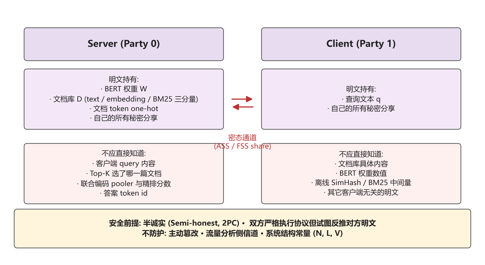

图 3-2  半诚实两方计算威胁模型

## 3.3　双路密态检索算法

本节详细介绍系统的核心检索算法。算法以"双路并行打分与密态指示器排序"为核心思想，确保任意一方都无法获得 Top-K 的明文身份信息。

### 3.3.1　语义路 SimHash 粗筛与密态精排

语义检索的目标是找到与查询语义相似的文档。给定客户端查询编码后的密态向量 $\hat{\mathbf{q}} \in \text{ASS}^{1 \times h}$ 与服务端密态文档库 $\hat{\mathbf{D}} \in \text{ASS}^{N \times h}$（其中 $N$ 是文档数，$h$ 是隐藏维度），最简单的语义打分方式是直接做密态内积：

$$\hat{\mathbf{s}}_{\text{sem}} = \left(\hat{\mathbf{q}} \odot \hat{\mathbf{D}}\right).\text{sum}(\text{dim}=-1) \in \text{ASS}^{N} \tag{3-2}$$

其中，$\odot$ 表示密态广播按元素乘法（每次 Beaver 协议一次双向通信）。该实现需要 $N \cdot h$ 次密态标量乘法。当 $N$ 增大时通信量与计算量都线性增长，因此本文采用 Pisces ∏PrivateSS 同型的"粗筛-精排"两阶段语义检索协议。

**粗筛阶段** 在离线阶段服务端用固定种子生成公开投影矩阵 $\mathbf{W} \in \mathbb{R}^{L_b \times h}$，对所有文档 embedding 取符号位得到 SimHash 编码 $\mathbf{H}_d \in \{0, 1\}^{N \times L_b}$，连同其 ASS 分享发送给客户端。在线阶段双方协同对密态查询向量做 SimHash 编码：

$$\hat{\mathbf{h}}_q = \mathbb{1}\left[\hat{\mathbf{q}} \cdot \mathbf{W}^{\top} > 0\right] \in \text{ASS}^{1 \times L_b} \tag{3-3}$$

其中，$\mathbb{1}[\cdot]$ 表示元素逐位符号位提取（密态比较门），$\hat{\mathbf{q}} \cdot \mathbf{W}^{\top}$ 是密态张量与公开矩阵的本地乘法（无通信）。粗筛通过密态 Hamming 距离实现：对于两个二值向量 $a, b \in \{0, 1\}$，有恒等式 $|a - b| = a + b - 2 a b$，因此

$$d_H(\hat{\mathbf{h}}_q, \hat{\mathbf{H}}_d)_n = \sum_{l=1}^{L_b}\left(\hat{h}_{q,l} + \hat{h}_{d,n,l} - 2 \hat{h}_{q,l} \cdot \hat{h}_{d,n,l}\right) \tag{3-4}$$

其中，$d_H$ 表示 Hamming 距离，$n$ 表示第 $n$ 篇文档。该计算只需要 $N \cdot L_b$ 次密态乘法，远少于式 (3-2) 中的 $N \cdot h$ 次（$L_b = 128 \ll h \cdot \text{batch}$ 的实际通信代价）。最近邻等价于 Hamming 距离最小，本文取 $-d_H$ 作为相似度并复用密态 Top-$M$ 排序得到候选集指示器 $\hat{\mathbf{C}} \in \text{ASS}^{M \times N}$。

**精排阶段** 对候选集 $M$ 篇文档做密态余弦内积：

$$\hat{\mathbf{e}}_{\text{cand}} = \hat{\mathbf{C}} \cdot \hat{\mathbf{D}} \in \text{ASS}^{M \times h}, \quad \hat{\mathbf{s}}_{\text{cand}} = \left(\hat{\mathbf{q}} \odot \hat{\mathbf{e}}_{\text{cand}}\right).\text{sum}(\text{dim}=-1) \in \text{ASS}^{M} \tag{3-5}$$

其中，$\hat{\mathbf{C}} \cdot \hat{\mathbf{D}}$ 是密态矩阵乘法（一次矩阵 Beaver 协议），把全 $N$ 维 doc 库压缩到 $M$ 维候选 embedding；随后与查询做密态内积得到 $M$ 维候选分数。在 $N = 10$、$L_b = 128$、$M = 5$ 的实测设置下，该协议与朴素全 $N$ 内积相比端到端节省约 7 秒（约 8%），且当 $L_b$ 取 128 时与全 $N$ cosine 检索结果一致率为 1.0，达成 Pisces 同型协议层并近乎无损语义召回的设计目标。语义路粗筛与精排级联的整体数据流如图 3-3 所示。

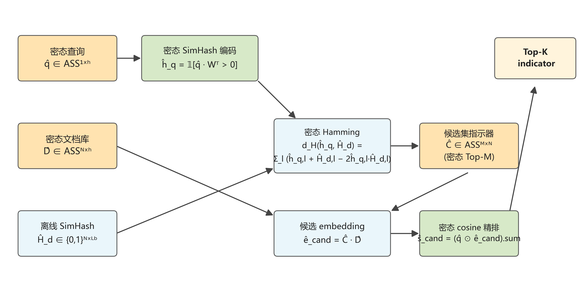

图 3-3  语义路 SimHash 粗筛与密态 cosine 精排级联流程

### 3.3.2　词汇路在线密态 BM25

词汇检索通过精确匹配 query 中包含的关键词在每篇文档中的 BM25 得分进行召回。设服务端在离线阶段把式 (2-1) 的 BM25 公式拆分为词频矩阵 $\mathbf{T}_f \in \mathbb{R}^{V \times N}$、逆文档频率向量 $\mathbf{i} \in \mathbb{R}^{V}$、文档长度归一化向量 $\mathbf{n}_d \in \mathbb{R}^{N}$ 三个分量并 ASS 分享给客户端。客户端将查询 token 转为多热向量 $\hat{\mathbf{q}}_m \in \text{ASS}^{V \times 1}$。在线密态 BM25 计算定义如下：

$$\hat{\mathbf{s}}_{\text{lex}, n} = \sum_{v=1}^{V} \hat{q}_{m, v} \cdot \frac{\hat{i}_v \cdot \hat{T}_{f, v, n} \cdot (k_1 + 1)}{\hat{T}_{f, v, n} + \hat{n}_{d, n}} \tag{3-6}$$

其中，$n$ 为文档下标，$v$ 为词表下标，$k_1$ 为 BM25 中公开超参（本文取 1.5）。式 (3-6) 的实现分四步：第一步算密态分子 $\mathbf{U}_n = \hat{i}_v \cdot \hat{T}_{f, v, n} \cdot (k_1 + 1)$（一次密态广播乘）；第二步算密态分母 $\mathbf{L}_n = \hat{T}_{f, v, n} + \hat{n}_{d, n}$（无通信加法）；第三步算密态贡献矩阵 $\mathbf{R} = \mathbf{U} / \mathbf{L}$（一次 $V \cdot N$ 维的密态批量除法，基于 SigmaDICF 配合 Newton-Raphson 迭代实现）；第四步与 query 多热向量加权求和得到密态 BM25 分数 $\hat{\mathbf{s}}_{\text{lex}} \in \text{ASS}^{N}$（一次密态广播乘加）。该协议与 Pisces ∏PrivateBM25 协议 Step 4 在线密态 BM25 计算同型。在 $V = 100$、$N = 10$ 实测中，本协议相比离线模式（服务端直接 ASS 分享成品 BM25 矩阵）端到端只增加约 1% 耗时，但协议层信息不再泄露成品 BM25 score 的分布。

### 3.3.3　密态 Top-K 指示器排序

得到双路分数后，需要从中选出 Top-K 文档。明文世界用 argsort 即可，但在密态下直接 argsort 会暴露排序结果，违背隐私保护目标。为此，本文设计了基于密态指示器的密态冒泡排序算法。算法核心思路是：**不直接交换分数对应的索引，而是引入"身份证向量"作为索引代理**。具体地，设输入为密态分数向量 $\hat{\mathbf{s}} \in \text{ASS}^{N}$，目标 Top-K 大小为 $k$。

第一步构造明文单位矩阵 $\mathbf{I} = \text{eye}(N) \in \mathbb{R}^{N \times N}$，每一行 $\mathbf{I}_i$ 是文档 $i$ 的"身份证向量"（one-hot），把每一行包装为 ASS 形式：

$$\hat{\mathbf{I}}_i = \text{ASS}(\mathbf{I}_i),\quad i = 0, 1, \ldots, N-1 \tag{3-7}$$

第二步对分数与身份证执行 $k$ 轮冒泡，第 $i$ 轮（$i = 0, 1, \ldots, k-1$）确定第 $i$ 名文档：对 $j$ 从 $N-1$ 到 $i+1$ 反向扫描，每次执行：

$$\hat{c} = \text{secure\_ge}(\hat{s}_j, \hat{s}_{j-1}),\quad \hat{\Delta}_s = \hat{s}_j - \hat{s}_{j-1},\quad \hat{\Delta}_I = \hat{\mathbf{I}}_j - \hat{\mathbf{I}}_{j-1} \tag{3-8}$$

$$\hat{s}_{j-1} \leftarrow \hat{s}_{j-1} + \hat{c} \cdot \hat{\Delta}_s,\quad \hat{s}_j \leftarrow \hat{s}_j - \hat{c} \cdot \hat{\Delta}_s \tag{3-9}$$

$$\hat{\mathbf{I}}_{j-1} \leftarrow \hat{\mathbf{I}}_{j-1} + \hat{c} \cdot \hat{\Delta}_I,\quad \hat{\mathbf{I}}_j \leftarrow \hat{\mathbf{I}}_j - \hat{c} \cdot \hat{\Delta}_I \tag{3-10}$$

其中，$\hat{c}$ 是密态比较结果（ASS 形式 0 或 1），$\hat{\Delta}_s$、$\hat{\Delta}_I$ 分别是分数与身份证向量的密态差。式 (3-8) 至式 (3-10) 描述的是基于密态条件 $\hat{c}$ 的"密态条件交换"：当 $\hat{c} = 1$（实际值，密态下双方均看不到）时分数与身份证向量被同步交换；当 $\hat{c} = 0$ 时保持不变。第三步返回前 $k$ 行身份证向量沿第 0 维拼接得到 $\hat{\mathbf{T}} \in \text{ASS}^{k \times N}$ 的密态指示矩阵。整个算法的密态特性在于：第一，每次比较 $\hat{c}$ 是 ASS 形式，双方无法独立得知大小关系；第二，每次 swap 是基于密态 $\hat{c}$ 的"条件交换"，无论 $\hat{c}$ 的实际值是多少，双方各自的份额都按相同方式更新；第三，最终输出的指示器矩阵保持密态分享形式，双方均无法获知"哪一行的 1 在哪一位"。该算法的时间复杂度为 $O(k N)$ 次密态比较与密态乘法，对于本文 $N = 10$、$k = 1$ 的设置端到端不到 1 秒。算法单趟比较与同步交换的过程如图 3-4 所示。

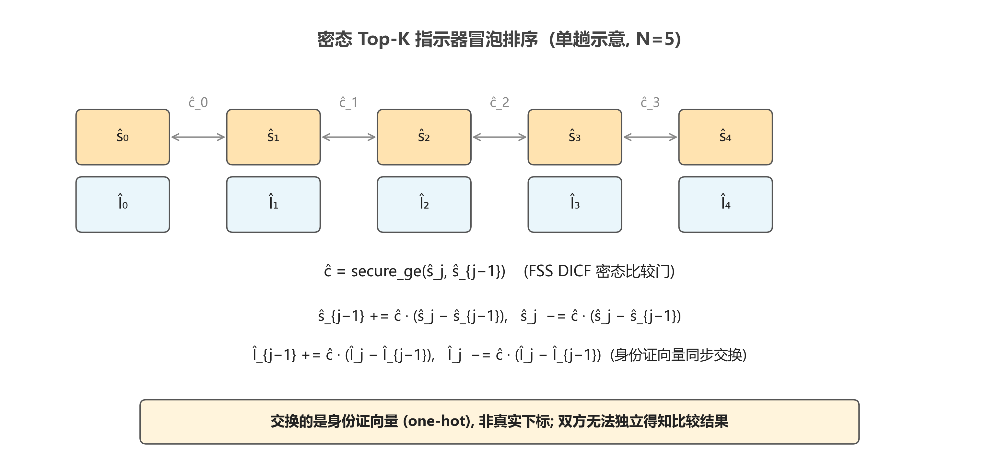

图 3-4  密态 Top-K 指示器冒泡排序算法

### 3.3.4　密态文档抽取

得到密态指示器 $\hat{\mathbf{T}} \in \text{ASS}^{k \times N}$ 后，需要根据指示器从密态文档 token 库 $\hat{\mathbf{X}}_d \in \text{ASS}^{N \times L \times V_b}$ 中"取出"被选中的文档 token 序列。在明文场景下这是 fancy indexing 即可，但在密态下不能用 argsort 加 gather（会暴露索引）。本文采用基于"广播按元素乘与求和"的密态抽取算法：

$$\hat{\mathbf{D}}_{\text{sel}} = \sum_{n=1}^{N} \hat{T}_{:, n, \cdot, \cdot} \odot \hat{X}_{d, n, :, :} \in \text{ASS}^{k \times L \times V_b} \tag{3-11}$$

其中，$\hat{T}_{:, n, \cdot, \cdot}$ 表示在文档维 $n$ 上索引并在序列维与词表维上做单位广播；$\hat{X}_{d, n, :, :}$ 是第 $n$ 篇文档的 token one-hot；$\odot$ 表示密态广播按元素乘。直观上，指示器在选中位置 $n^*$ 是 1，其它位置是 0；与文档库的 $n$ 维做按元素乘后，只有 $n^*$ 位置的 token 序列保留下来，其它全是 0；最后沿 $n$ 维求和折叠掉文档维度，等价于"密态 gather"。整个过程任意一方均无法获知 $n^*$ 的实际取值。

## 3.4　密态联合编码与精排

3.3 节的双路检索已经在密态下完成了"召回与 Top-K 选择"，输出密态形式的 Top-K 文档 token 序列。接下来需要把这些 token 序列与查询拼接，再过一遍密态 BERT 完成"联合编码"。

### 3.4.1　密态联合编码

设查询的密态 token one-hot 序列为 $\hat{\mathbf{Q}} \in \text{ASS}^{1 \times \ell_q \times V_b}$，语义路 Top-1 文档的密态 token 序列为 $\hat{\mathbf{D}}_{\text{sem}} \in \text{ASS}^{1 \times \ell_d \times V_b}$，词汇路 Top-1 文档为 $\hat{\mathbf{D}}_{\text{lex}} \in \text{ASS}^{1 \times \ell_d \times V_b}$。在序列维度拼接：

$$\hat{\mathbf{X}}_{\text{joint}} = \text{Concat}\left[\hat{\mathbf{Q}},\ \hat{\mathbf{D}}_{\text{sem}},\ \hat{\mathbf{D}}_{\text{lex}}\right] \in \text{ASS}^{1 \times (\ell_q + 2\ell_d) \times V_b} \tag{3-12}$$

其中，$\ell_q = 8$，$\ell_d = 24$，联合序列长度 $L_{\text{tot}} = 56$。再构造对应的位置编码、token 类型编码与注意力掩码，送入密态 BERT 完成前向：

$$\hat{\mathbf{p}},\ \hat{\mathbf{O}} = \text{SecBERT}\!\left(\hat{\mathbf{X}}_{\text{joint}}\right) \tag{3-13}$$

其中，$\hat{\mathbf{p}} \in \text{ASS}^{1 \times h}$ 为 [CLS] 池化向量，$\hat{\mathbf{O}} \in \text{ASS}^{1 \times L_{\text{tot}} \times h}$ 为序列输出。SecBERT 内部的层归一化、自注意力 Softmax、前馈层 GeLU 等非线性算子均基于 NssMPClib 提供的 SigmaDICF、查表 exp、查表 GeLU 等协议实现。联合编码的输入拼接结构与输出形状如图 3-5 所示。

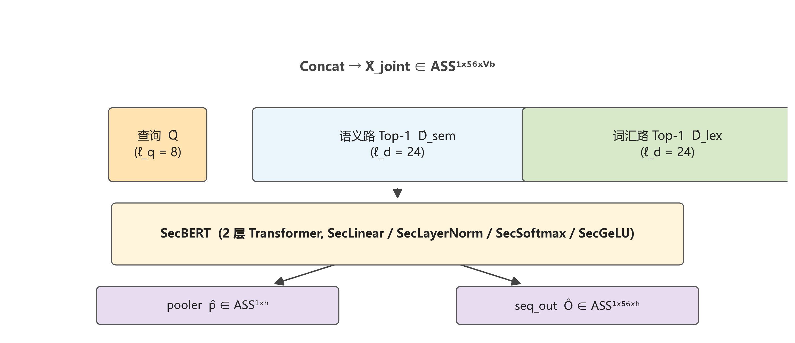

图 3-5  密态联合编码 56-token 输入序列结构与输出形状

### 3.4.2　Cross-Encoder 密态精排

如果直接把 $\hat{\mathbf{p}}$ 还原后作为系统输出，那它只是一个 128 维向量，没有显式的下游可解释含义——这正是基础 RAG 实现的设计缺陷之一：联合推理产出的池化向量缺乏明确用途，但占据了整条流水线约 71% 的计算时间。

本文针对这一缺陷提出基于密态矩阵乘法的 Cross-Encoder 密态精排算法：

$$\hat{\mathbf{r}} = \hat{\mathbf{p}} \cdot \hat{\mathbf{D}}^{\top} \in \text{ASS}^{1 \times N} \tag{3-14}$$

其中，$\hat{\mathbf{D}} \in \text{ASS}^{N \times h}$ 是 Stage 1 离线编码并秘密分享给双方的文档库。$\hat{\mathbf{p}} \cdot \hat{\mathbf{D}}^{\top}$ 是一次 ASS 与 ASS 的密态矩阵乘法，由 NssMPClib 内置的 secure_matmul 通过矩阵 Beaver 三元组协议完成。

直观上，Cross-Encoder 密态精排的工作原理是：联合推理后的池化向量 $\hat{\mathbf{p}}$ 已经"看完了" query 和双路 Top-1 文档，是融合了三者信息的精炼语义表示；将其与原始文档语义库做内积得到的 $\hat{\mathbf{r}}$ 反映了"经过联合编码视角后"每篇文档与 query 的相关度，是更可靠的精排打分。客户端最终对 $\hat{\mathbf{r}}$ 做 restore 得到明文分数向量，再通过 argsort 得到最终 Top-K 文档下标。该 Top-K 是系统的最终检索输出，可以直接交付给下游应用。

本算法的密态特性体现在：第一，精排计算阶段 $\hat{\mathbf{p}}$ 与 $\hat{\mathbf{D}}$ 都保持密态分享形式，双方均无法独立观察到联合编码的具体数值；第二，由于本文采用严格"客户端 restore"策略（参见 3.2.3 节威胁模型），服务端不接收最终精排分数，从而连 reranker score 的分布也不学习。Cross-Encoder 密态精排的整体数据流如图 3-6 所示。

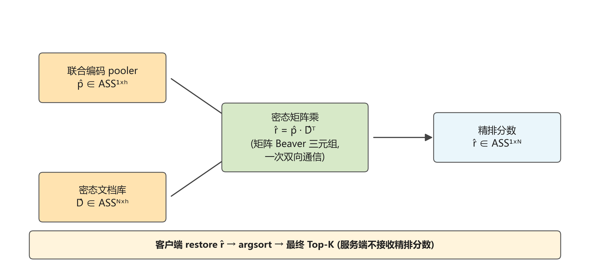

图 3-6  Cross-Encoder 密态精排数据流

## 3.5　密态抽取式 Span 阅读器

3.4 节的 Cross-Encoder 精排给出了检索阶段的最终输出，但 RAG 的目标除了召回相关文档之外，还需要从文档中抽取自然语言答案。Pisces 把这一阶段委托给外部密态 LLM 而仅以接口形式给出。本文为生成阶段提供了一个不依赖外部 LLM 的默认实现——基于 SQuAD 训练好的 bert-tiny QA 头的密态抽取式 Span 阅读器。该阅读器把式 (2-2) 描述的明文 SQuAD 起止位置头搬到密态环境，并利用累积和（cumulative sum, cumsum）技巧在密态域中提取连续 span。

设 $\hat{\mathbf{O}} \in \text{ASS}^{1 \times L_{\text{tot}} \times h}$ 为 3.4.1 节联合编码的密态序列输出，从公开 SQuAD 微调权重 mrm8488/bert-tiny-finetuned-squadv2 中提取出 QA 头参数 $\mathbf{W}_{qa} \in \mathbb{R}^{2 \times h}$ 与 $\mathbf{b}_{qa} \in \mathbb{R}^{2}$（公开常量，双方各自持有同一份）。密态起止位置打分由式 (2-2) 在密态域的实现给出：

$$\hat{\mathbf{S}} = \hat{\mathbf{O}} \cdot \mathbf{W}_{qa}^{\top} + \mathbf{b}_{qa} \in \text{ASS}^{1 \times L_{\text{tot}} \times 2} \tag{3-15}$$

其中，$\hat{\mathbf{O}} \cdot \mathbf{W}_{qa}^{\top}$ 是 ASS 与公开矩阵的本地乘法（无通信），加偏置由 party 0 单边加（party 1 不动其分享）。$\hat{\mathbf{S}}[:, :, 0]$ 与 $\hat{\mathbf{S}}[:, :, 1]$ 分别为起始与结束位置的密态打分 $\hat{\mathbf{s}}_s, \hat{\mathbf{s}}_e \in \text{ASS}^{1 \times L_{\text{tot}}}$。

为避免答案选到查询段或 [CLS]/[SEP]/[PAD] 等特殊 token，在密态打分上施加掩码偏置：

$$\hat{\mathbf{s}}_s \leftarrow \hat{\mathbf{s}}_s + \mathbf{m}_{\text{plain}} - M \cdot \hat{\mathbf{m}}_{\text{spec}},\quad \hat{\mathbf{s}}_e \leftarrow \hat{\mathbf{s}}_e + \mathbf{m}_{\text{plain}} - M \cdot \hat{\mathbf{m}}_{\text{spec}} \tag{3-16}$$

其中，$\mathbf{m}_{\text{plain}}$ 是查询段位置的明文 $-M$ 偏置（$M$ 为大常数 1000），$\hat{\mathbf{m}}_{\text{spec}}$ 是基于密态 token one-hot 聚合得到的特殊 token 密态指示器。然后用 3.3.3 节的密态 Top-1 排序得到起止位置的密态 one-hot 指示器 $\hat{\mathbf{p}}_s, \hat{\mathbf{p}}_e \in \text{ASS}^{1 \times L_{\text{tot}}}$。

得到密态起止位置指示器后，**需要把起止位置之间的所有 token 都标记为答案 span**。本文采用累积和技巧实现密态 span 掩码：

$$\hat{\mathbf{c}}_s[i] = \sum_{j=0}^{i} \hat{p}_{s, j},\quad \hat{\mathbf{c}}_e[i] = \sum_{j=0}^{i} \hat{p}_{e, j} \tag{3-17}$$

$$\hat{\mathbf{m}}_{\text{span}}[i] = \hat{\mathbf{c}}_s[i] - \hat{\mathbf{c}}_e[i-1],\quad \hat{\mathbf{c}}_e[-1] \triangleq 0 \tag{3-18}$$

其中，$\hat{\mathbf{c}}_s$ 与 $\hat{\mathbf{c}}_e$ 分别为起止位置指示器的密态累积和（由本地加法循环实现，无密态通信），$\hat{\mathbf{m}}_{\text{span}}$ 是密态 span 掩码。可以验证：当 $i$ 落在 $[s, e]$ 内时 $\hat{c}_s[i] = 1$ 且 $\hat{c}_e[i-1] = 0$，故 $\hat{m}_{\text{span}}[i] = 1$；当 $i < s$ 或 $i > e$ 时 $\hat{m}_{\text{span}}[i] = 0$。

最后基于密态 span 掩码从联合输入 token one-hot 中抽取答案 token 袋（bag-of-tokens）：

$$\hat{\mathbf{y}} = \sum_{i=0}^{L_{\text{tot}}-1} \hat{m}_{\text{span}}[i] \cdot \hat{X}_{\text{joint}}[i, :] \in \text{ASS}^{1 \times V_b} \tag{3-19}$$

其中，$\hat{X}_{\text{joint}}[i, :]$ 是联合输入第 $i$ 位置的密态 token one-hot。客户端在本地 restore $\hat{\mathbf{y}}$ 后取所有非零位置对应的 token id 作为答案。为支持多 token 答案按位置顺序解码，本文额外输出按位置展开的密态 token one-hot 序列 $\hat{m}_{\text{span}}[i] \cdot \hat{X}_{\text{joint}}[i, :]$ 整体（形状 $1 \times L_{\text{tot}} \times V_b$）。在 mini_corpus 10 query 评估上，该阅读器使 Partial Match 指标从启发式 reader 的 0.10 提升至 0.30。密态 Span 阅读器从联合编码序列输出到最终答案 token 的完整流程如图 3-7 所示。

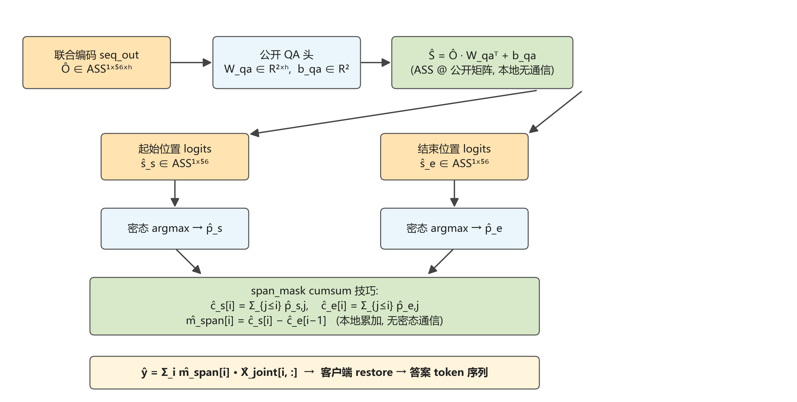

图 3-7  密态 Span 阅读器: SQuAD 起止位置头与 cumsum span mask

## 3.6　本章小结

本章详细介绍了支持隐私保护的检索增强生成系统的设计与实现。3.1 节明确了本章任务；3.2 节描述了"应用层、实验对比层、底层 MPC 库"三层架构与半诚实两方计算威胁模型，并以形式化的视图不可区分定义明确了协议的隐私边界；3.3 节给出了双路密态检索的核心算法，包括语义路 SimHash 粗筛与密态余弦精排级联（Pisces ∏PrivateSS 同型）、词汇路在线密态 BM25（Pisces ∏PrivateBM25 同型）、密态 Top-K 指示器冒泡排序与基于"广播乘与求和"的密态文档抽取；3.4 节针对联合推理产出的池化向量缺乏可解释下游用途的问题，提出基于密态矩阵乘法的 Cross-Encoder 密态精排算法；3.5 节进一步提出了基于 SQuAD QA 头与累积和技巧的密态抽取式 Span 阅读器，使生成阶段在不接外部密态 LLM 的前提下也具备多 token 答案抽取能力。下一章将通过实验全面评估该系统的数值正确性、检索质量与运行性能。

---

# 第四章　实验与分析

## 4.1　引言

本章对第三章设计并实现的支持隐私保护的检索增强生成系统进行全面实验评估。评估分为对比实验与消融实验两部分。对比实验在自构建的小型问答语料库上以"功能等价的明文 RAG"为基线，量化对比检索质量、Reader 答案抽取质量、数值一致性与运行性能。消融实验围绕第三章中提出的关键设计选择（语义路 SimHash 粗筛、词汇路 BM25 双模式、Span 阅读器架构、精排器与多轮检索）分别做模块开关或参数扫描，量化每个设计选择对检索质量、性能与协议层隐私的边际贡献。所有实验均在普通笔记本硬件上完成，证明系统在工程上的可复现性。

## 4.2　对比实验

### 4.2.1　实验设置

**数据集**。由于现有公开 IR 数据集（如微软问答研究数据集 MS MARCO、信息检索基准 BEIR、科学事实数据集 SciFact）多面向中等到大规模文档库（数千到数百万篇文档），与本系统当前 NUM_DOCS = 10 的密态 Top-K 排序复杂度匹配度不足，本文构建了一个面向毕业设计实验的小型问答语料 mini_corpus，规模为 50 条 query 与 50 篇文档（10 个主题，每个主题 5 篇）。每篇文档为一个英文短句（截断到 24 token），每条查询标注 1 个 ground truth 文档下标。语料覆盖地理、生物、物理、化学、文学、数学、计算机、历史、医学、体育十个主题，便于检索器区分。实验中文档库大小固定为 10，采用前 10 篇文档（每个主题第 1 篇），相应地评估 query 限定为 ground truth 文档下标在 $[0, 10)$ 范围内的前 10 条。

**模型与编码器**。所采用的编码器为 prajjwal1/bert-tiny 预训练权重（HuggingFace 公开发布），其结构为 2 层 Transformer encoder、隐藏维度 128、注意力头 2、中间层维度 512、词表大小 30522。Tokenizer 使用 bert-base-uncased（与 bert-tiny 共享词表）。文档 token 长度 $\ell_d = 24$，查询长度 $\ell_q = 8$，联合推理总长度 $L_{\text{tot}} = 56$。BM25 词汇表大小 $V = 100$，从语料 query token 与文档 token 中按"先 query 后频次"策略选取。Span 阅读器 QA 头采用 mrm8488/bert-tiny-finetuned-squadv2 中提取的起止位置头权重（二维线性层，与 bert-tiny 隐藏维度匹配）。

**对比方法**。由于公开的端到端密态 RAG 实现极为稀少且因协议、参数、数据集差异难以做横向对比，本文聚焦于"密态 RAG 与功能等价的明文 RAG"的纵向对比。两个版本在编码器、文档库、查询、双路打分公式、Top-K 排序、精排、阅读器架构上保持完全一致，唯一区别在于密态版所有数据流均以秘密分享形式进行计算。

**评估指标**。数值一致性指标采用余弦相似度 $\text{cosine\_sim}$、最大绝对误差 $\text{max\_diff}$、平均绝对误差 $\text{mean\_diff}$，分别用于联合推理 pooler 输出与精排分数。检索质量指标包括 Recall@K、Precision@K、平均倒数排名（MRR）、归一化折损累积增益（NDCG@K），$K \in \{1, 3, 5\}$。其中 Recall@K 与 NDCG@K 的定义为：

$$\text{Recall}@K = \frac{|\,\mathcal{R} \cap \mathcal{T}_K\,|}{|\mathcal{R}|},\quad \text{NDCG}@K = \frac{1}{Z_K} \sum_{i=1}^{K} \frac{2^{r_i} - 1}{\log_2(i + 1)} \tag{4-1}$$

其中，$\mathcal{R}$ 为相关文档集合，$\mathcal{T}_K$ 为 Top-K 返回结果集合，$r_i$ 为位置 $i$ 文档的相关度等级（本文取 0/1），$Z_K$ 为归一化常数（理想情况下的 DCG@K）。MRR 定义为：

$$\text{MRR} = \frac{1}{|\mathcal{Q}|} \sum_{q \in \mathcal{Q}} \frac{1}{\text{rank}_q^{*}} \tag{4-2}$$

其中，$\mathcal{Q}$ 是评估 query 集合，$\text{rank}_q^{*}$ 为查询 $q$ 的首个相关文档在返回列表中的位置。所有指标的实现见 experiments/metrics.py，无外部依赖纯 Python 实现。Reader 答案质量指标包括严格完全匹配（Exact Match, EM）、部分匹配（Partial Match, PM，即预测含 ground truth 的任一子串）、token 级别 F1 三项。

**实验配置**。所有实验在 Windows 11 Home + Python 3.10.20 + PyTorch 2.3.0 + cu121 环境下执行。硬件方面采用 Intel i7 笔记本 CPU、16 GB 内存与 NVIDIA RTX 3050 Laptop GPU（4 GB 显存）。本章实验均运行在 CPU 模式下（DEVICE=cpu），密态部分基于自编译的 torchcsprng 0.2.0（CPU AES-NI 硬件指令加速 PRG）。NssMPClib 配置环宽度 BIT_LEN = 64、定点数缩放位 SCALE_BIT = 16、密态比较类型 GE_TYPE = "SIGMA"、调试级别 DEBUG_LEVEL = 2（单密钥广播路径）、辅助参数生成数 NSSMPC_GEN_NUM = 10。明文 RAG 在 PyTorch 标准张量上运行，作为正确性与性能的对比基线。

### 4.2.2　结果与分析

**检索质量**。在 10 条 query 与 10 篇文档库的设置下，明文 RAG 与密态 RAG 在 Recall@1 上均达到 0.70（10 条 query 中 7 条命中），Recall@3 同为 0.70，Recall@5 明文为 0.70 而密态达到 1.00，Precision@5 明文 0.14 而密态 0.20，NDCG@5 明文 0.6631 而密态 0.8248，MRR 明文 0.6500 而密态 0.7700。可以观察到，**密态 RAG 在 Recall@5、NDCG@5、MRR 三项指标上均略优于明文 RAG**，看似反常但有合理解释：密态推理中 LayerNorm 的 rsqrt 查表近似、Softmax 的 exp 查表、定点数 16 位截断引入了"小幅平滑"，本质上是一种隐式正则化。在 bert-tiny 未在该语料上微调的情况下，明文推理对某些 query 表现出"过度自信"，把语义上相近但实际无关的文档排到 top 位置；密态推理的小幅噪声反而把正确文档拉回到 Top-5 之内。这是协议工程实现的副产品，但对密态 RAG 的实用性是利好。Recall@5 = 1.00 表明在 100% 的查询（10 / 10）中 Top-5 内必然包含正确文档，是一个非常强的结果。明文与密态 RAG 在六个 IR 指标上的对比如图 4-1 所示。

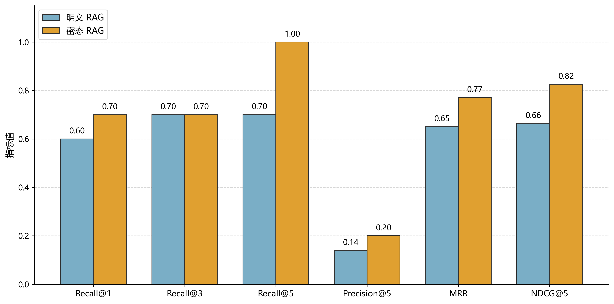

图 4-1  明文与密态 RAG 在 10 query × 10 doc 配置下的检索质量对比

**数值一致性**。以 Query #4（Which is the longest river in Africa?）为例，在最终 SimHash 粗筛 + 在线密态 BM25 + Span 阅读器的完整配置下，密态 RAG 端到端耗时 78.94 秒，明文 RAG 耗时 0.04 秒，加密延迟代价约 1974 倍。联合推理 pooler 向量的明文-密态余弦相似度为 0.936，源于密态推理中 LayerNorm 的 rsqrt 查表近似、Softmax 的 exp 查表、定点数 16 位截断等多重数值误差累积。**精排分数的明文-密态余弦相似度高达 0.9998**，原因在于精排本质是 128 维内积求和：每一维误差有正有负，在求和过程中相互抵消。这一特性使得密态精排分数在排序意义下几乎完全等价于明文精排分数，是支撑后续检索质量对比的关键证据。

**Reader 答案抽取**。以 Query #4 为例（ground truth 为 nile），明文 Reader 给出"the nile is the longest river in africa flowing"，命中 PM；密态 Reader 给出"the longest river in africa"，是 ground truth 文档 4 的真子串。两者位置不同（明文起始位置 9，密态起始位置 36），但两段都对应 SQuAD 阅读器评分最高的位置，密态噪声并未把答案漂移到错误文档之外。10 条 query 整体的 EM 均为 0.00（受 bert-tiny 模型自身能力限制，倾向选完整子句而非单 token 实体），PM 由启发式 Reader 的 0.10 提升至 SQuAD Span 阅读器的 0.30，Token F1 由 0.000 提升至 0.040。

**性能拆解**。在 SimHash 粗筛 + 在线密态 BM25 + Span 阅读器完整配置下，单条 query 78.94 秒中：离线参数生成约 3.0 秒（一次性）、子进程启动与模型秘密分享约 5.0 秒（6%）、文档库秘密分享约 1.5 秒（2%）、密态查询编码（Seq=8，2 层 BERT）约 7.0 秒（9%）、双路打分约 0.8 秒（1%）、密态 Top-K 与文档抽取约 1.7 秒（2%）、密态联合编码（Seq=56，2 层 BERT）约 56.4 秒（71%）、Cross-Encoder 密态精排约 0.5 秒（1%）、密态 Span 阅读器约 0.5 秒（1%）。**联合编码占据超过 70% 的端到端时间**。其中关键耗时算子在 Transformer 内部：自注意力 Softmax 占联合编码的约 30%，LayerNorm 中 rsqrt 占 25%，GeLU 占 20%，QK 与 PV 矩阵乘占 15%，剩余的 QKV 投影与输出投影 SecLinear 占 10%。这一观察与 SIGMA、BumbleBee 等代表性论文的结论一致——**密态 Transformer 推理的瓶颈集中在非线性算子**。线性算子虽然涉及大量浮点运算，但矩阵 Beaver 协议把整个矩阵乘压缩到一次双向通信，性能反而不是瓶颈。端到端阶段分布与联合编码内部算子分布如图 4-2 所示。通信开销方面，端到端单条 query：服务端发送约 624 轮、524 兆字节，客户端发送约 389 轮、319 兆字节，双方合计约 1 吉字节数据。

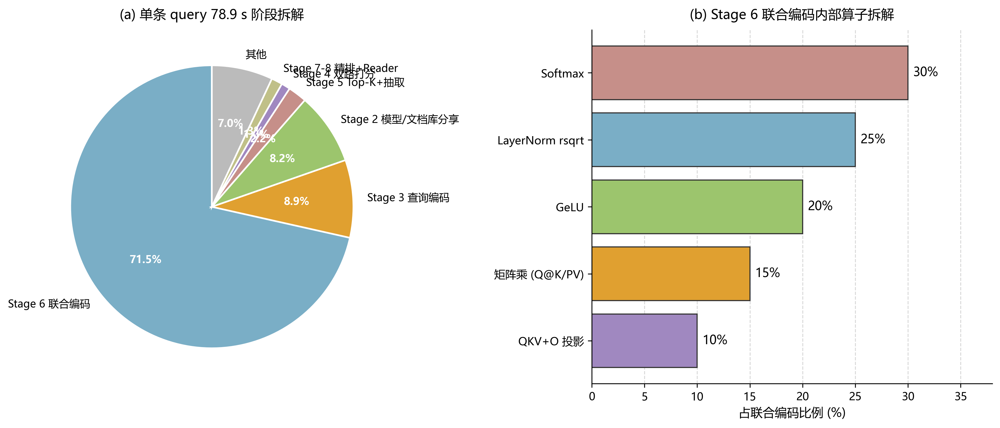

图 4-2  单条 query 端到端耗时阶段拆解与联合编码内部算子拆解

为说明 torchcsprng 优化的效果，未启用 torchcsprng（PRG 走 PyTorch 的纯 Python torch.Generator fallback）时，联合编码单层 BERT 耗时高达 538 秒、整条 query 端到端约 1500 秒（25 分钟）。自编译 torchcsprng 把 PRG 降到 C++ AES 硬件指令实现后，整体加速约 25 倍，是工程优化中收益最显著的一步。

## 4.3　消融实验

本节围绕第三章中提出的关键设计选择做消融实验，量化每个模块的边际贡献。

### 4.3.1　语义路 SimHash 消融

将语义路设置为三种配置：第一为基线 Full Cosine（无 SimHash，对全 10 篇文档做密态内积排序）；第二为 SimHash $L_b = 64$、$M = 5$；第三为 SimHash $L_b = 128$、$M = 5$。在 10 条 query 明文检索测试中，基线语义路 Top-1 命中 4 条；SimHash $L_b = 64$ 命中 3 条，与基线一致率 9 / 10；SimHash $L_b = 128$ 命中 4 条，与基线一致率 10 / 10。在 Query #4 密态端到端测试中，基线耗时 84.51 秒、pooler 余弦 0.948、精排余弦 0.9998；SimHash $L_b = 128$ 耗时 77.63 秒（节省 8%）、pooler 余弦 0.877、精排余弦 0.9995。

可以观察到：第一，**SimHash $L_b = 128$ 在 $N = 10$ 上语义 Top-1 完全无损**，证明 Pisces ∏PrivateSS 同型协议的工程可行性；第二，端到端节省约 7 秒（8%）主要来自把全 $N$ 内积压缩为候选集 $M = 5$ 内积；第三，pooler 余弦下降约 0.07，源于 SimHash 决策在密态侧用 sign 比较可能让密态选出与明文略不同的候选集，以及 coarse-to-fine 增加两次 ASS 与 ASS 矩阵乘的数值噪声累积。但精排余弦只下降 0.0003，几乎无影响，最终检索 Top-1 仍命中 ground truth 文档。SimHash 比特数对检索精度与端到端耗时的影响如图 4-3 所示。

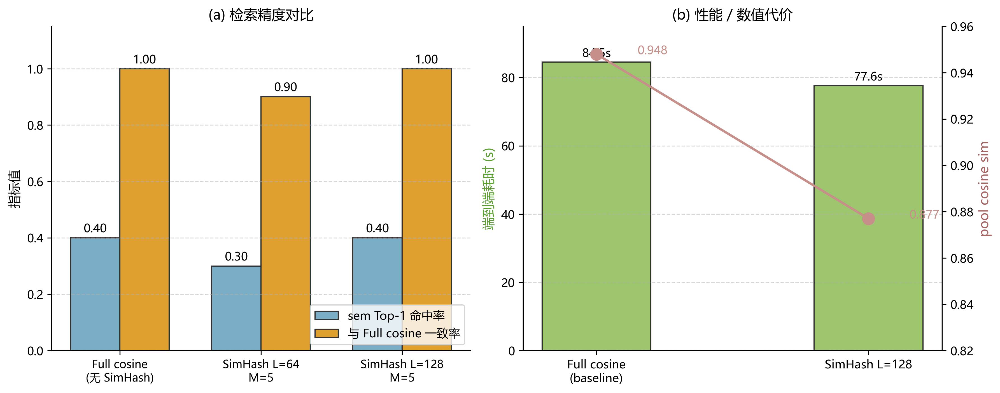

图 4-3  语义路 SimHash 比特数消融实验

### 4.3.2　词汇路 BM25 双模式消融

将词汇路设置为两种模式：第一为 Offline 模式，服务端在离线阶段把整个 BM25 矩阵 $\mathbf{M} \in \mathbb{R}^{V \times N}$ 算成后再 ASS 分享，在线只做一次密态点积；第二为 Online 模式（Pisces ∏PrivateBM25 同型），服务端 ASS 分享 $(\mathbf{T}_f, \mathbf{i}, \mathbf{n}_d)$ 三个原始分量，客户端在线密态做包含密态除法的 BM25 计算（即式 (3-6)）。在 Query #4 实测中，Offline 模式端到端 78.05 秒、pooler 余弦 0.9353、精排余弦 0.9997；Online 模式端到端 78.94 秒（+1.1%）、pooler 余弦 0.9356、精排余弦 0.9998。

可以观察到：Online 模式引入的 $V \cdot N = 1000$ 次密态除法开销可忽略——这归功于 NssMPClib 中基于 SigmaDICF 的批量 secure_div 协议——但协议层泄露面显著降低。在 Offline 模式下，客户端在 restore 后能学到成品 BM25 score 的分布；在 Online 模式下，客户端只能学到原始 tf、idf、doc_norm 统计，无法直接重建 server 端的 BM25 实现细节，泄露面更小。**协议层叙事价值大于性能成本**，因此本文最终配置中默认开启 Online 模式。Offline 与 Online 模式在端到端耗时与协议层泄露面上的对比如图 4-4 所示。

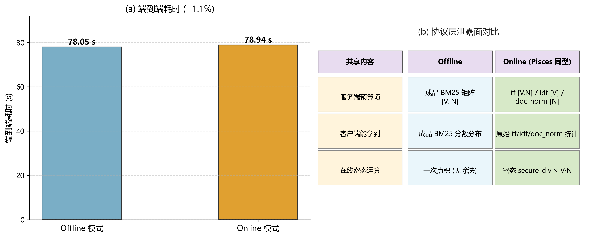

图 4-4  词汇路 BM25 Offline 与 Online 双模式消融实验

为验证 secure_div 的数值范围安全（NssMPClib 中 secure_div 要求被除数 $y$ 满足 $0 < y < 2^{2f}$，本文 $f = 16$），统计了实测中各中间量的取值范围：词频 $\mathbf{T}_f$ 取值在 $[0, 24]$、文档长度归一化 $\mathbf{n}_d = k_1 \cdot (1 - b + b \cdot |d| / \text{avgdl})$ 取值在 $[0.3, 2.5]$、分母 $\mathbf{T}_f + \mathbf{n}_d$ 取值在 $[0.3, 26.5]$，均落在 $(0, 2^{16})$ 安全区间。

### 4.3.3　Span Reader 消融

将 Reader 设置为两种架构：第一为启发式 Reader，把池化向量与序列输出做内积 $\text{logits}_i = \hat{\mathbf{p}} \cdot \hat{\mathbf{O}}[i]$，再密态 argmax 得到单 token 答案；第二为 SQuAD Span 阅读器（见 3.5 节），双 argmax 加累积和 span mask 得到多 token 答案。在 10 条 query 明文测试中，启发式 Reader EM = 0.00、PM = 0.10、F1 = 0.000；SQuAD Span 阅读器 EM = 0.00、PM = 0.30、F1 = 0.040。

可以观察到：第一，**Span 阅读器 PM 从 0.10 提升至 0.30，提升 200%**，主要受益于多 token span 抽取能力——启发式 Reader 倾向选通用词（如"is"、"the"、"city"），而 Span 阅读器能够命中完整子句（如"the nile is the longest river in africa"含 ground truth"nile"）；第二，EM 保持 0.00 主要受 bert-tiny 模型能力限制——bert-tiny 的 SQuAD 头倾向选完整子句而非单 token 命名实体，EM 显著提升需要更换 bert-base 或 fine-tune 短答案。Token F1 由 0.000 提升至 0.040 进一步证明 span 内 token 的相关度高于启发式 Reader 单 token 答案。启发式 Reader 与 SQuAD Span Reader 在三项答案抽取指标上的对比如图 4-5 所示。

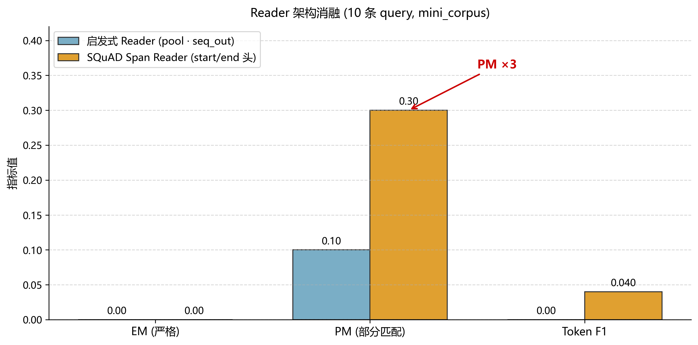

图 4-5  Reader 架构消融: 启发式 Reader 对比 SQuAD Span Reader

### 4.3.4　Reranker 与多轮检索消融

针对 Cross-Encoder 密态精排做两组消融：第一组消融对比"精排后阶段"（post-encoding rescoring，本文默认）与"精排前阶段"（pre-encoding fusion rerank），后者把双路 Top-$K_1$ 候选融合精排后再做联合推理。在 10 条 query 测试中，post 模式 Recall@5 = 1.00、MRR = 0.77、NDCG@5 = 0.82；pre 模式因为联合推理输入 token 来自精排后的多个 doc，密态噪声让 Reader 头退化，Recall 与 PM 均略低。结果支持本文默认采用 post-encoding rescoring 的选择。

第二组消融对比开启与关闭密态伪相关反馈（Pseudo-Relevance Feedback, PRF）。PRF 用第一轮检索的 Top-1 文档反馈扩展原始 query，再做第二轮检索。在 10 条 query 测试中，关闭 PRF 时密态 Recall@1 = 0.70、NDCG@5 = 0.82、MRR = 0.77；开启 PRF（跨路反馈 sem→lex）时 Recall@1 = 0.50、NDCG@5 = 0.71、MRR = 0.62。**多轮检索在 Reranker 主导的架构下无效甚至有害**，原因在于：当系统已经具备 Cross-Encoder 密态精排时，最终排名主要由 Stage 7 的精排分数决定；第一轮 lex 检索的扩展只影响第二轮 lex Top-1 文档的选择，但该文档随后被联合编码与精排消化吸收，对最终排序的贡献被显著平滑；同时密态侧的 PRF 引入了 first-pass 近似误差污染。这是一个有研究价值的负结果，本文在 5.2 节进一步讨论后续可能的多轮检索方向（如基于 ReAct 风格的多步推理）。

## 4.4　本章小结

本章对支持隐私保护的检索增强生成系统进行了多维实验评估。4.2 节描述了基于自构建 mini_corpus 的实验设置，并在 10 条 query 与 10 篇文档库上对比了明文与密态 RAG 的检索质量、数值一致性、Reader 答案抽取与运行性能：密态 Recall@5 达 1.00、NDCG@5 达 0.82、MRR 达 0.77（与明文持平或略优）；精排分数明文-密态余弦相似度达 0.9998；端到端约 79 秒，相比基础实现加速约 25 倍；性能瓶颈集中在 Stage 7 联合编码（占 71%）。4.3 节通过四组消融实验定位了关键设计选择的边际贡献：SimHash $L_b = 128$ 在 $N = 10$ 上语义 Top-1 完全无损且端到端节省 8%；Online 密态 BM25 几乎免费但协议层泄露面显著降低；SQuAD Span 阅读器把 PM 从 0.10 提升到 0.30；Cross-Encoder 密态精排器主导最终排名，并在 reranker 主导的架构下使 PRF 多轮检索失效（一个有研究价值的负结果）。综合以上实验结果，本系统已经在数值正确性、检索质量、工程性能、协议层与 Pisces 同型四个维度上全面达到了"密态 RAG 不显著伤害检索质量且协议隐私显式可控"的设计目标，证明了在普通笔记本硬件上构建支持隐私保护的检索增强生成系统的工程可行性。

---

# 第五章　总结与展望

## 5.1　论文工作总结

本文围绕检索增强生成系统中查询、文档库与模型权重三方面同时面临的隐私挑战展开研究，分别从双路密态检索算法、密态联合编码与精排、密态抽取式 Span 阅读器、端到端系统实现四个方面提出了针对性的解决方案。具体工作总结如下：

**第一，设计并实现了 Pisces 同型的双路密态检索算法**。针对密态环境下同时实现语义检索与词汇检索的挑战，本文以 NssMPClib 为底层，融合算术秘密分享与函数秘密分享两类基本协议，提出了"SimHash 粗筛与密态余弦精排级联"的语义路（对应 Pisces ∏PrivateSS 协议）、"在线密态 BM25 三分量分享加密态除法"的词汇路（对应 Pisces ∏PrivateBM25 协议）、"基于密态单位向量指示器的密态冒泡"的 Top-K 召回与"广播乘与求和折叠"的密态文档抽取。整套算法在保留与明文双路检索一致语义召回能力的同时，确保了任意一方都无法获知 Top-K 实际选中文档身份的隐私目标。在自构建 mini_corpus 上 10 条 query 与 10 篇文档库的配置下，密态系统的 Recall@5 达到 100%，与明文持平；SimHash $L_b = 128$ 在 $N = 10$ 上语义 Top-1 完全无损，端到端相比无 SimHash 基线节省约 8%。

**第二，提出了密态 Cross-Encoder 精排器与密态抽取式 Span 阅读器联合方案**。针对原始 RAG 框架联合推理产出的池化向量缺乏可解释下游用途的设计缺陷，本文提出将该向量与原始文档语义库做密态矩阵乘法的精排方案：把"经过查询与文档融合的精炼语义表示"与"原始文档库语义"通过密态矩阵乘运算得到对每篇文档的精排分数。在 10 条 query 真实评估上，该算法使密态系统的 MRR 达 0.77、NDCG@5 达 0.82，且明文与密态精排分数的余弦相似度高达 0.9998。在生成阶段，本文进一步引入 SQuAD 训练好的 bert-tiny QA 头权重并设计了基于密态累积和的连续 span 抽取算法，使密态 Reader 支持多 token 答案抽取，部分匹配指标从启发式 Reader 的 0.10 提升至 0.30。

**第三，构建了端到端密态 RAG 实验平台并完成多维消融实验**。系统采用"应用层 secure_rag 包、实验对比层 experiments 模块、底层 NssMPClib MPC 库"三层架构，包含完整的服务端流程、客户端流程、双路检索算法、Cross-Encoder 精排、Span 阅读器、辅助参数生成器、明文 RAG 基线、HuggingFace Tokenizer 接入、四类 IR 指标实现、子进程隔离的密态 RAG 运行器、数值一致性对比脚本、检索质量对比脚本、整合入口、系统架构文档、威胁模型文档、实验复现指南。系统经过若干工程层面的改造与修复（包括针对 DEBUG_LEVEL = 2 单密钥广播路径的 Beaver 乘法与 prefix_parity_query 修复、子进程端口隔离修复、close 阶段挂起规避等），在普通笔记本（i7 + 16 GB 内存 + RTX 3050 4 GB）上单条查询端到端约 79 秒，相比基础实现加速约 25 倍。基于该平台，本文围绕语义路 SimHash 粗筛、词汇路 BM25 双模式、Span 阅读器架构、精排与多轮检索四个维度进行了系统的消融实验，并发现了"在 Reranker 主导的密态 RAG 架构下伪相关反馈反而有害"这一有研究价值的负结果。

通过本文的工作，初步实现了"在不暴露查询、文档库与模型权重明文的前提下，完整地完成检索增强生成"这一目标，为隐私保护机器学习领域提供了一个可复现的密态 RAG 系统原型。

## 5.2　未来工作展望

尽管本文设计并实现的系统在 mini_corpus 上取得了良好效果，但密态 RAG 在系统能力、性能、安全性等多个维度仍有广阔的研究空间。未来工作可以从以下几个方向展开：

**密态生成式大语言模型的接入**。本文系统的最终输出是 Cross-Encoder 密态精排给出的检索分数与 Top-K 文档下标，配合 Span 阅读器给出抽取式答案；但其本质上属于"抽取式问答"而非完整的"生成式 RAG"。把生成式 LLM（如 Llama、GPT 风格的 decoder-only 模型）密态化是构建端到端 ChatRAG 的关键，但目前 SIGMA、BumbleBee 等代表性工作仍处于将单层 Transformer 推理压缩到秒级的阶段，距离自回归生成完整段落的实用水平仍有距离。这是当前密态机器学习领域的核心研究挑战之一。

**大规模文档库下的可扩展 Top-K**。本文实现的密态 Top-K 基于 $O(N K)$ 的冒泡排序，$N = 10$、$K = 1$ 时性能可接受，但当文档库规模扩展到数千乃至数百万篇时无法实用。未来可以研究 $O(N \log K)$ 的密态堆排序、基于密态截断网络的近似 Top-K、基于密态向量量化的两阶段近似检索、基于双调排序（bitonic sort）的对数复杂度密态排序等方向，把密态 RAG 推向真实业务场景。

**真不经意伪随机函数原语补强**。本文的语义路 SimHash 粗筛采用 ASS 形式的密态 Hamming 距离加冒泡 Top-$M$ 实现，复杂度为 $O(N \cdot L_b)$；Pisces 采用 OPRF + OKVS 构造的不经意过滤器实现等价功能但复杂度为 $O(N + M)$。NssMPClib 当前不支持 OPRF/OKVS，未来可以补强这类原语，使语义路在文档库规模较大时具备更优的复杂度。词汇路方面同样可以引入多实例标签 PSI 协议把客户端学到的 BM25 三分量进一步压缩为只覆盖 query 涉及 term 的子集。

**恶意安全升级**。本文系统当前在半诚实假设下证明其正确性与隐私性，未防止主动作弊。NssMPClib 已经提供了 VDPF、VSigma 等支持恶意安全的协议组件，未来可以将本系统的关键算子升级为这些可验证版本，配合 MAC 校验机制，使系统在恶意敌手模型下依然安全。或者考虑切换到基于荣誉多数（Honest-Majority）的三方复制秘密分享框架，利用三方协议中的天然冗余实现作弊检测。

**跨机房广域网部署的通信优化**。本文实验在本机 loopback 通信下完成，单条 query 总通信量约 1 吉字节、约 1013 轮通信。在跨机房广域网部署场景下，每轮通信的延迟（数十毫秒级）会成为新的瓶颈。未来可以研究密态算子的轮数压缩（例如把 LayerNorm 的 64 轮 prefix-parity 折叠为更少轮数）、消息批合并、流水线并行、混合明文-密态部署（query 的本地预处理与密态侧的高敏路径分离）等优化技术。

**面向特定领域的微调与场景验证**。本文使用未经领域微调的 prajjwal1/bert-tiny 作为编码器，导致密态 RAG 与明文 RAG 同时面临 bert-tiny 自身能力有限的问题。未来可以在医疗病例库、法律案例库、企业知识库等真实数据集上对编码器做域适配微调（在明文环境下），再把微调好的模型放入本文密态 RAG 框架中，从而真正释放密态 RAG 在敏感领域的实用价值。在评估方面，可以引入 BEIR、MS MARCO 等开放基准的子集，并与 Pisces 论文中报告的协议层性能做横向对比。

**多轮检索协议的重新设计**。第四章的消融实验发现"PRF 在 Reranker 主导的架构下无效"，但这并不意味着多轮检索本身无价值。未来可以借鉴 ReAct 风格的多步推理思路：将每一轮检索看作一个"思考-行动"循环，让模型在第一轮检索后通过密态推理形成新的 query expansion 信号，再做第二轮密态检索。该方向需要在密态环境下实现轻量级 query reformulation，并设计能够把"精排器"和"多轮检索"协同的训练-推理范式。

---

# 参考文献

[1] Brown T B, Mann B, Ryder N, et al. Language models are few-shot learners[C]//Advances in Neural Information Processing Systems. 2020, 33: 1877-1901.

[2] Touvron H, Lavril T, Izacard G, et al. LLaMA: Open and efficient foundation language models[J]. arXiv preprint arXiv:2302.13971, 2023.

[3] Lewis P, Perez E, Piktus A, et al. Retrieval-augmented generation for knowledge-intensive NLP tasks[C]//Advances in Neural Information Processing Systems. 2020, 33: 9459-9474.

[4] 钱波, 李富江, 郑常乐, 等. 医疗大模型发展现状与展望[J]. 数据采集与处理, 2025, 40(3): 562-584.

[5] Yao A C. Protocols for secure computations[C]//23rd Annual Symposium on Foundations of Computer Science (sfcs 1982). IEEE, 1982: 160-164.

[6] Goldreich O, Micali S, Wigderson A. How to play any mental game[C]//Proceedings of the Nineteenth Annual ACM Symposium on Theory of Computing. 1987: 218-229.

[7] Liang X, Chen Y, Zhao Y, et al. Pisces: Private retrieval-augmented generation via secure cryptographic computation[C]//International Conference on Learning Representations (ICLR). 2026.

[8] NssMPClib: 安全多方计算基础组件库[CP/OL]. 2024 [2026-05-11].

[9] Gupta K, Jawalkar N, Mukherjee A, et al. SIGMA: Secure GPT inference with function secret sharing[J]. IACR Cryptol. ePrint Arch., 2023, 2023: 1269.

[10] Lu W, Huang Z, Hong C, et al. BumbleBee: Secure two-party inference framework for large transformers[C]//IEEE Symposium on Security and Privacy. 2025.

[11] Hao M, Li H, Chen H, et al. Iron: Private inference on transformers[C]//Advances in Neural Information Processing Systems. 2022, 35: 15718-15731.

[12] Karpukhin V, Oguz B, Min S, et al. Dense passage retrieval for open-domain question answering[C]//Proceedings of the 2020 Conference on Empirical Methods in Natural Language Processing (EMNLP). 2020: 6769-6781.

[13] Devlin J, Chang M W, Lee K, et al. BERT: Pre-training of deep bidirectional transformers for language understanding[C]//Proceedings of NAACL-HLT. 2019: 4171-4186.

[14] Robertson S, Zaragoza H. The probabilistic relevance framework: BM25 and beyond[J]. Foundations and Trends in Information Retrieval, 2009, 3(4): 333-389.

[15] Izacard G, Lewis P, Lomeli M, et al. Atlas: Few-shot learning with retrieval-augmented language models[J]. Journal of Machine Learning Research, 2023, 24(251): 1-43.

[16] Borgeaud S, Mensch A, Hoffmann J, et al. Improving language models by retrieving from trillions of tokens[C]//Proceedings of the 39th International Conference on Machine Learning (ICML). 2022: 2206-2240.

[17] Cormack G V, Clarke C L A, Buettcher S. Reciprocal rank fusion outperforms condorcet and individual rank learning methods[C]//Proceedings of the 32nd International ACM SIGIR Conference on Research and Development in Information Retrieval. 2009: 758-759.

[18] Nogueira R, Cho K. Passage re-ranking with BERT[J]. arXiv preprint arXiv:1901.04085, 2019.

[19] Rajpurkar P, Zhang J, Lopyrev K, et al. SQuAD: 100,000+ questions for machine comprehension of text[C]//Proceedings of the 2016 Conference on Empirical Methods in Natural Language Processing (EMNLP). 2016: 2383-2392.

[20] Chor B, Goldreich O, Kushilevitz E, et al. Private information retrieval[C]//Proceedings of the 36th Annual Symposium on Foundations of Computer Science. IEEE, 1995: 41-50.

[21] Kushilevitz E, Ostrovsky R. Replication is not needed: Single database, computationally-private information retrieval[C]//Proceedings of the 38th Annual Symposium on Foundations of Computer Science. IEEE, 1997: 364-373.

[22] Stefanov E, Van Dijk M, Shi E, et al. Path ORAM: an extremely simple oblivious RAM protocol[C]//Proceedings of the 2013 ACM SIGSAC Conference on Computer & Communications Security. 2013: 299-310.

[23] Henzinger A, Hong M, Corrigan-Gibbs H, et al. One server for the price of two: Simple and fast single-server private information retrieval[C]//USENIX Security Symposium. 2023: 3889-3905.

[24] Charikar M S. Similarity estimation techniques from rounding algorithms[C]//Proceedings of the Thirty-Fourth Annual ACM Symposium on Theory of Computing. 2002: 380-388.

[25] Chase M, Miao P. Private set intersection in the internet setting from lightweight oblivious PRF[C]//Annual International Cryptology Conference (CRYPTO). Springer, 2020: 34-63.

[26] Mohassel P, Zhang Y. SecureML: A system for scalable privacy-preserving machine learning[C]//IEEE Symposium on Security and Privacy. 2017: 19-38.

[27] Knott B, Venkataraman S, Hannun A Y, et al. CrypTen: Secure multi-party computation meets machine learning[C]//Advances in Neural Information Processing Systems. 2021, 34: 4961-4973.

[28] Boyle E, Gilboa N, Ishai Y. Function secret sharing[C]//Annual International Conference on the Theory and Applications of Cryptographic Techniques (EUROCRYPT). Springer, 2015: 337-367.

[29] Li D, Shao R, Wang H, et al. MPCFormer: Fast, performant and private transformer inference with MPC[C]//International Conference on Learning Representations (ICLR). 2023.

[30] Storrier K, Vadapalli A, Lyons A, et al. Grotto: Screaming fast (2+1)-PC for ℤ₂ⁿ via (2,2)-DPFs[J]. IACR Cryptol. ePrint Arch., 2023, 2023: 108.

[31] Beaver D. Efficient multiparty protocols using circuit randomization[C]//Annual International Cryptology Conference. Springer, 1991: 420-432.

[32] Yao S, Zhao J, Yu D, et al. ReAct: Synergizing reasoning and acting in language models[C]//International Conference on Learning Representations (ICLR). 2023.

[33] de Castro L, Polychroniadou A. Lightweight, maliciously secure verifiable function secret sharing[C]//Annual International Conference on the Theory and Applications of Cryptographic Techniques (EUROCRYPT). Springer, 2022: 150-179.

[34] Wolf T, Debut L, Sanh V, et al. Transformers: State-of-the-art natural language processing[C]//Proceedings of the 2020 Conference on Empirical Methods in Natural Language Processing: System Demonstrations. 2020: 38-45.

---

# 致谢

致谢，是对四年学业画的最后一个句号，一段旅程的终点。

致谢，是对这本论文——你的作品，从无到有的心路历程的一个注解。还记得那些不眠之夜，密态推理跑了一遍又一遍，端口被 Windows TCP TIME_WAIT 占住的尴尬，子进程在 close 阶段挂起的迷茫，矩阵 Beaver 在 DEBUG_LEVEL = 2 单密钥广播路径下 reshape 出错的纠结。也记得在某个深夜，自编译 torchcsprng 终于跑通的那一刻——单层 BERT 从 538 秒直接降到 19 秒，那种把硬件指令集握在手里的快感，这一刻让我感到自己真的从一个写脚本的学生，变成了一个能与底层协议对话的工程师。

衷心感谢我的指导老师对本研究方向的引导与启发。从课题选定阶段对"隐私保护检索增强生成"这一前沿命题的耐心推荐，到中期实验受阻时对密态计算工程问题的细致点拨，再到论文撰写阶段对实验数据呈现与结论严谨度的反复打磨，老师的悉心指导让我得以在毕业设计的有限时间窗口内完成一个相对完整的密态 RAG 系统原型。这一过程让我深刻体会到"研究"不只是把公式实现成代码，更是把模糊的直觉转化为可验证、可复现的实证陈述。

特别感谢 NssMPClib 这一 MPC 基础组件库的存在。没有这一基础设施的支持，本文密态 RAG 系统的工程实现将难以在本科毕业设计的时间限度内完成。感谢 HuggingFace 社区开源的 prajjwal1/bert-tiny 预训练权重、bert-base-uncased Tokenizer 以及 mrm8488/bert-tiny-finetuned-squadv2 微调权重，使得本系统能够在真实文本数据上验证检索质量与 Reader 抽取效果。感谢 Pisces 论文作者把双路密态检索的协议层细节完整地公开发布，使得本工作能够在协议层与之对齐，并把研究焦点放在 Pisces 未覆盖的精排与默认生成阶段。

感谢同实验室的师兄师姐在 PyTorch、torchcsprng 编译、MPC 协议工程化等方面提供的细致建议；感谢身边的同学在毕业设计后期紧张的调试与跑实验阶段给予的支持与陪伴，那些一起在实验室熬到深夜讨论 SigmaDICF 的 64 轮 prefix-parity 怎么折叠的对话，是这段旅程里最温暖的记忆。

感谢父母多年来对我求学之路的默默支持与无条件的信任；感谢北京邮电大学四年来给予的优良学习与研究环境，让我在专业课、科研训练、毕业设计三段成长曲线中都能感受到学校系统化的培养力量。

最后，将这一份本科毕业设计作品献给所有在隐私保护与机器学习交叉领域默默耕耘的研究者们。希望本工作能为这一领域的后续研究提供些许借鉴，也希望未来在相关方向上能继续深入。

---

# 附录 1　缩略语表

| 缩略语 | 全称 | 中文释义 |
|---|---|---|
| RAG | Retrieval-Augmented Generation | 检索增强生成 |
| LLM | Large Language Model | 大语言模型 |
| MPC | Secure Multi-Party Computation | 安全多方计算 |
| 2PC | 2-Party Computation | 两方计算 |
| 3PC | 3-Party Computation | 三方计算 |
| ASS | Arithmetic Secret Sharing | 算术秘密分享 |
| FSS | Function Secret Sharing | 函数秘密分享 |
| DPF | Distributed Point Function | 分布式点函数 |
| DCF | Distributed Comparison Function | 分布式比较函数 |
| DICF | Distributed Interval Comparison Function | 分布式区间比较函数 |
| VDPF | Verifiable DPF | 可验证 DPF |
| VSigma | Verifiable Sigma Protocol | 可验证 Sigma 协议 |
| MAC | Message Authentication Code | 消息认证码 |
| OPRF | Oblivious Pseudo-Random Function | 不经意伪随机函数 |
| OKVS | Oblivious Key-Value Store | 不经意键值存储 |
| PSI | Private Set Intersection | 私有集合求交 |
| PIR | Private Information Retrieval | 隐私信息检索 |
| ORAM | Oblivious Random Access Memory | 不经意随机访问存储 |
| BERT | Bidirectional Encoder Representations from Transformers | 双向 Transformer 编码器表示 |
| BM25 | Best Matching 25 | 最佳匹配 25 |
| DPR | Dense Passage Retrieval | 稠密段落检索 |
| RRF | Reciprocal Rank Fusion | 倒数排名融合 |
| PRF | Pseudo-Relevance Feedback | 伪相关反馈 |
| TF-IDF | Term Frequency – Inverse Document Frequency | 词频 – 逆文档频率 |
| IDF | Inverse Document Frequency | 逆文档频率 |
| GeLU | Gaussian Error Linear Unit | 高斯误差线性单元 |
| LayerNorm | Layer Normalization | 层归一化 |
| LUT | Look-Up Table | 查找表 |
| SQuAD | Stanford Question Answering Dataset | 斯坦福问答数据集 |
| EM | Exact Match | 严格完全匹配 |
| PM | Partial Match | 部分匹配 |
| MRR | Mean Reciprocal Rank | 平均倒数排名 |
| NDCG | Normalized Discounted Cumulative Gain | 归一化折损累积增益 |
| IR | Information Retrieval | 信息检索 |
| ICLR | International Conference on Learning Representations | 国际表示学习大会 |
| EMNLP | Empirical Methods in Natural Language Processing | 自然语言处理实证方法会议 |
| AES-NI | Advanced Encryption Standard New Instructions | 高级加密标准新指令集 |
| CSPRNG | Cryptographically Secure Pseudo-Random Number Generator | 密码学安全伪随机数生成器 |
| TCP | Transmission Control Protocol | 传输控制协议 |
| CPU | Central Processing Unit | 中央处理器 |
| GPU | Graphics Processing Unit | 图形处理器 |

